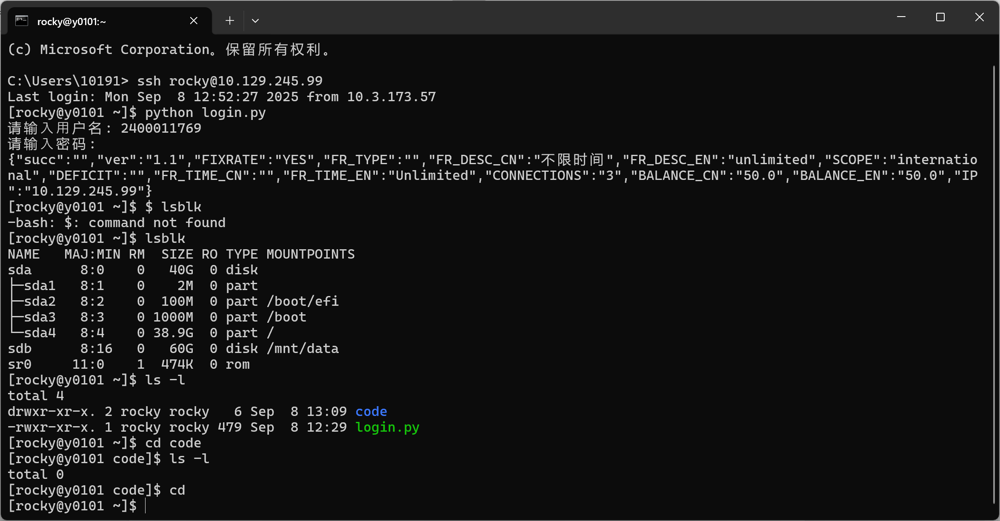

# Assignment #1: 虚拟机，Shell & 大语言模型

Updated 1745 GMT+8 Sep 8, 2025

2025 fall, Complied by <mark>杨浩 化院</mark>

## 1. 题目

### E27653: Fraction类

http://cs101.openjudge.cn/pctbook/E27653/

请练习用OOP方式实现。

用时：10min

思路：

+ 定义分数与分数加法

+ 通过找最大公约数实现约分

代码：

```python
class Fraction:
    def __init__(self,fenzi,fenmu):
        self.fenmu=fenmu
        self.fenzi=fenzi
    def jiafa(self,x):
        z=Fraction((x.fenzi)*(self.fenmu)+(x.fenmu)*(self.fenzi),x.fenmu*self.fenmu)
        return Fraction.yuefen(z)
    def yuefen(self):
        maxi=1
        for i in range(2,max(self.fenzi,self.fenmu)+1):
            if self.fenzi%i==0 and self.fenmu%i==0:
                maxi=max(maxi,i)
        return Fraction(self.fenzi//maxi,self.fenmu//maxi)
    def print1(self):
        print(f'{self.fenzi}/{self.fenmu}')
if __name__ == '__main__':
    alist=list(map(int,input().split()))
    a=Fraction(alist[0],alist[1])
    b=Fraction(alist[2],alist[3])
    c=Fraction.jiafa(a,b)
    Fraction.print1(c)
```


代码运行截图 <mark>（至少包含有"Accepted"）</mark>


### M1760.袋子里最少数目的球

binary search, https://leetcode.cn/problems/minimum-limit-of-balls-in-a-bag/

用时：45min

思路：

+ 初见时采取和**M08210.河中跳房子**相同的策略，但没发现边界条件不同，一直有错误样例。后来想清楚了边界条件，重写了`left`和`right`移动的代码，解决了问题


代码：

```python
from typing import List
class Solution:
    def minimumSize(self, nums: List[int], maxOperations: int) -> int:
        def check(nums,mid):
            t=0
            for i in nums:
                t +=(i-1)//mid
                if t>maxOperations:
                    return True
            return False
        
        left=1
        right=max(nums)+1
        ans=-1
        while right>left:
            mid=(left+right)//2
            if check(nums,mid):
                left =mid+1
            else:
                right=mid
                ans=mid
        return ans

if __name__ == '__main__':
    solution = Solution()
    res = solution.minimumSize(nums = [10,10,10,10,10,10], maxOperations = 5)
    print(res)
```


代码运行截图 <mark>（至少包含有"Accepted"）</mark>


### M04135: 月度开销

binary search, http://cs101.openjudge.cn/pctbook/M04135/

用时：20min

思路：

+ 与前面一个问题相同，疑似摸索出这一类问题通用解法：`while`条件上取等，`left`和`right`都移动，最终输出的答案一定在`left`和`right`中出现，稍加尝试就可以找到正确输出答案。

代码：

```python
n,m=map(int,input().split())
l=[]
for i in range(n):
    l.append(int(input()))
right=sum(l)+1
left=max(l)
peak=0
while left<=right:
    mid=(left+right)//2
    s=0
    t=1
    for i in l:
        if s+i<=mid:
            s +=i
        else:
            t +=1
            s=i
    if t>m:
        left =mid+1
    else:
        right=mid-1
    
print(left)
```


代码运行截图 <mark>（至少包含有"Accepted"）</mark>


### M27300: 模型整理

sortings, AI, http://cs101.openjudge.cn/pctbook/M27300/

用时：25min

思路：

+ 暑假时DSA做的，当时的思路就当作一般的字符串整理做的。当时还不会 `dict()` 的 `.setdefault()` ,写得也很复杂。

代码：

```python
def paixu(alist):
    blist=[]
    mlist=[]
    for i in alist:
        if i[-1]=='B':
            if '.' in i:
                blist.append(float(i[:-1]))
            else:
                blist.append(int(i[:-1]))
        else:
            if '.' in i:
                mlist.append(float(i[:-1]))
            else:
                mlist.append(int(i[:-1]))
    blist.sort()
    mlist.sort()
    out=[str(i)+'M' for i in mlist]
    out=out+[str(i)+'B' for i in blist]
    return out
n=int(input())
l=[]
dic={}
for i in range(n):
    l.append(input())
    wei=l[i].index('-')
    name=l[i][:wei]
    num=l[i][wei+1:]
    if name in dic:
        dic[name]=dic[name]+[num]
    else:
        dic[name]=[num]
sorted_dic=dict(sorted(dic.items()))
for i in sorted_dic:
    out=', '.join(paixu(sorted_dic[i]))
    print(i+': '+out)
```


代码运行截图 <mark>（至少包含有"Accepted"）</mark>


### Q5. 熟悉云虚拟机Linux环境与大语言模型（LLM）本地部署

本项目包括两个任务：

1）通过云虚拟机（如 https://clab.pku.edu.cn/ 提供的资源）熟悉Linux系统操作环境。

2）完成大语言模型（LLM）的本地部署与功能测试。

LLM 部署可选择使用图形化工具（如 LM Studio, https://lmstudio.ai）以简化配置流程，提升部署效率。部署完成后，需对模型进行实际能力测试。

测试内容包括：从主流在线编程评测平台（如 OpenJudge、Codeforces、LeetCode 或洛谷等）选取若干编程题目，提交由本地部署的 LLM 生成的代码解决方案，并确保其能够通过全部测试用例，获得“Accepted”状态。选题时应避免与已知可被 AI 正确解答的题目重复。当前已确认可通过的 AI 解题列表可参考以下 GitHub 仓库： 

https://github.com/GMyhf/2025spring-cs201/blob/main/AI_accepted_locally.md


请提供你的项目进展，内容应该包括：关键操作步骤的截图以及遇到的技术问题及相应的解决方法。这将有助于全面掌握项目推进情况，并为后续优化与扩展提供依据。

#### 云虚拟机的使用




#### LLM的本地部署与功能测试

##### 基本信息

1）测试模型：deepseek/deepseek-r1-0528-qwen3-8b

2）测试编程题目：LC20.[有效的括号](https://leetcode.cn/problems/valid-parentheses/)

##### 关键步骤截图


##### Ai解题输出内容

###### Ai思考过程

首先，问题是判断一个字符串是否包含有效的括号序列。字符串只包含 '('、')'、'{'、'}'、'[' 和 ']' 这几种字符。

有效字符串的条件：

1. 左括号必须用相同类型的右括号闭合。
2. 左括号必须以正确的顺序闭合。
3. 每个右括号都有一个对应的左括号。

示例中，"()" 是有效的；"()[]{}" 也是有效的；"(]" 和 "([)]" 是无效的。字符串长度至少为1，最多到10^4个字符。

我需要在Python中实现这个功能。一种常见的方法是使用栈（stack）来跟踪左括号的出现和匹配。

思路：

- 遇到左括号时，将其压入栈。
- 遇到右括号时，检查栈顶是否有对应的左括号。如果有，则弹出；否则无效。
- 如果字符串结束时栈为空，则有效；否则有未闭合的左括号，也无效。

定义一个字典来映射每个右括号对应的左括号： 例如：'(' 对应 ')'、'[' 对应 ']'、'{' 对应 '}'

然后遍历字符串中的字符：

- 如果字符是左括号，则入栈。
- 如果字符是右括号，则检查栈顶是否匹配。如果不匹配，返回False；如果匹配，弹出栈顶元素。

最后，检查栈是否为空。

考虑边界情况：空字符串时，栈应该为空，所以有效？示例中没给出，但根据条件，每个右括号都有对应的左括号，并且所有左括号都闭合。空字符串是有效的吗？

提示说长度至少为1，所以s非空。但在代码实现中，需要处理空字符串的可能性。

在示例中，没有提到空字符串，所以我应该假设输入总是有字符的。但为了健壮性，还是考虑一下。

另外，如果遇到右括号时栈为空，则立即无效。

算法步骤：

1. 创建一个字典或映射：例如，mapping = {'(': ')', '[': ']', '{': '}'}
2. 初始化一个空栈。
3. 遍历字符串s的每个字符：
   - 如果当前字符是左括号（即 '('、'[' 或 '{'），则将其压入栈。
   - 否则，检查栈是否为空。如果为空，则右括号没有对应的左括号，返回False。 否则，弹出栈顶元素，并检查它是否是当前字符的匹配左括号。如果不是，则无效（因为顺序不对）。

更精确地说：

- 当遇到右括号时，比如 ')', 则看栈顶元素是否为 '('。如果是，则弹出；否则返回False。 类似地处理 '[' 和 ']' 等其他类型。

但在代码中，我需要区分左括号和右括号。

我可以先检查字符是开括号还是闭括号：

- 如果char in "({[", 则它是开括号，入栈。
- 否则，如果是闭括号，则进行匹配检查。

对于闭括号的匹配：例如 ')' 应该与 '(' 匹配。所以，我可以定义一个reverse字典或直接使用条件判断。

实际上，由于字符集小，我可以用一个字符串包含开括号和它们对应的闭括号，然后查找。

但最好还是用一个映射。

在Python中，可以这样实现：

def isValid(s): # 定义匹配的映射 mapping = {'(': ')', '[': ']', '{': '}'} # 或者使用dict(zip(keys, values)) stack = [] for char in s: if char in ['(', '[', '{']: stack.append(char) else:  # 它是一个闭括号 if len(stack) == 0:  # 栈为空，没有匹配的左括号 return False top_char = stack.pop() if mapping.get(top_char) != char: return False

```
return len(stack) == 0
```

测试一下： 示例1：s = "()" -> true 遍历'('，入栈['(']；然后')'，检查栈顶 '(' 的匹配是 ')' ，所以弹出，并且栈为空时返回true。

示例2："()[]{}" 同样有效。

示例3："(]" -> 字符串开始 '(' 入栈，然后遇到 ']'。栈不空，弹出 '('，但 '(' 不应该被 ']' 匹配，因为映射中 '{' 对应 '}' 等等，所以 mapping.get('(') 返回 ')' ，与输入的 ']' 不匹配，返回False。

示例4："([])" -> 有效。 入栈 '[' 和 '[', 遇到第一个']'时，弹出最近左括号 '[' 并检查是否匹配。然后遇到')'，弹出栈顶 '(' 并检查匹配（是），最后栈空，true。

但这里有一个问题：当字符串为"([])"时，在第二步遇到 ']', 栈中有两个元素吗？不，顺序是：第一个字符是'('入栈，第二个字符是']'。在代码中，我将所有开括号都视为左，并直接入栈，但类型不同。

在这个例子中，'[' 是左括号，所以入栈；然后遇到 ']' 时，它应该匹配 '['。但在我的映射中，mapping.get('[') 应该返回 ']'，是的，在示例3中我没有定义 mapping 的所有键值对？在代码里我只用了开括号作为key。

在我的代码中，我检查了 if char in ['(', '[', '{'] ，然后入栈。对于闭括号，使用 else 分支。

但当我遇到 ']' 时，它是闭括号，所以我弹出栈顶，并用 mapping 检查：mapping.get(top_char) 应该返回对应的闭括号。

在示例3中："(]"

- 遇到 '(' 入栈 ['(']
- 遇到 ']' ，是闭括号，检查栈：有元素，弹出 '('。然后 mapping.get('(') 返回 ')' ，而输入的 char 是 ']'] 不等于 ')', 所以返回False。

示例4："([])"

- 字符1: '[' 入栈 ['[']
- 字符2: ']' 闭括号，检查栈：有元素，弹出 '['。mapping.get('[') 返回 ']' ，匹配输入 char ']'] 所以继续。
- 字符3: ')' 闭括号，现在栈是空的吗？在弹出 '[' 后，栈应该还有 '(' 如果有的话。

"([])" 长度为5个字符：索引0:'(', 索引1:'[', 索引2:']', 索引3:')'

在我的代码中：

- 迭代char: '(' -> 左括号入栈，stack = ['(']
- 接下来char: '[' -> 左括号入栈，stack = ['(', '[']
- 接下来char: ']' -> 闭括号。检查stack不空，弹出'['。mapping.get('[') 是']' ，输入是']' , 匹配。
- 然后stack现在有 '(' 剩下
- 接下来char: ')' -> 闭括号。pop stack, 得到'('。mapping.get('(') 返回')', 输入也是')', 匹配.
- 所以栈空，返回True。

示例5："([)]"

- 字符1: '(' 入栈 ['(']
- 字符2: '[' 左括号入栈 ['(', '[']
- 字符3: ')' 闭括号。pop stack, 得到'['。但 mapping.get('[') 是']', 输入是')', 不匹配，所以返回False。

完美。

现在考虑空字符串：s为空时，在循环中不添加元素，最后len(stack)==0 返回True。这符合要求吗？题目说长度至少为1，但在实际编程中可能需要处理更一般的情况。不过既然提示指定了长度>=1，我们可以假设输入非空，但代码还是应该能处理空字符串。

此外，如果遇到无效字符怎么办？例如 s = "abc" 或混合其他字符，但问题描述中说s仅由括号组成，所以我们不需要担心无效字符。

在映射字典里，我需要为所有开括号定义对应的闭括号。我的代码已经用了'(', '[', '{'作为key，并对应')',']','}'。

现在，实现代码：

def isValid(s): mapping = {'(': ')', '[': ']', '{': '}'} stack = []

```
for char in s:
    if char in ['(', '[', '{']:
        stack.append(char)
    else:
        # 当前字符是闭括号
        if not stack:  # 栈为空，无法匹配
            return False
        top_char = stack.pop()
        if mapping[top_char] != char:
            return False
            
return len(stack) == 0
```

由于长度至少为1，并且只有这些字符，所以不需要额外处理无效输入。

但为了完整性，在pop时使用mapping[top_char] ，如果char不在闭括号集合中呢？但我们已经检查了else分支是当字符不是开括号时执行的。在字符串中，字符只能是这些六个：'(', ')', '[', ']', '{', '}'

所以，如果遇到右大括号或什么但栈空，会返回False。

另一个情况：字符串长度为奇数，则不可能有效。例如 s = "()" 长度4（偶），s="(" 长度1（奇）无效，在代码中我们检查了当闭括号时栈不空，并且最后栈为空，所以如果左括号多出来也会被捕捉到。

测试一个简单例子：s="(" -> 最后len(stack)!=0 返回False。正确。

s=")" -> 当遇到右括号时，栈空返回False。

现在，写成函数形式。

在Python中，可以定义为：

class Solution: def isValid(self, s: str) -> bool:

或者只是全局的isValid函数。

由于是编程问题，可能需要类方法，但题目没指定，所以我假设一个简单的函数即可。如果是在LeetCode上提交，通常使用类方法，但这里我直接写函数。

最终代码：

def isValid(s): mapping = {'(': ')', '[': ']', '{': '}'} stack = [] for char in s: if char in mapping.keys(): stack.append(char) else: # 当前字符是闭括号，需要检查栈 if not stack: return False top_char = stack.pop() if mapping[top_char] != char: return False return len(stack) == 0

但在这个代码中，我使用了if char in map.keys()，这会包括开括号。映射的keys是'(', '[', '{'

在else分支，如果char不在map.keys()中，则它是闭括号：')',']','}'。

由于字符串只包含这些字符，并且闭括号就是mapping.values()中的元素，我可以检查当前char是否属于闭括号集合。

但代码应该工作正常。

为了更清晰，可以定义开括号集合：

brackets = "()[]{}" left_brackets = "({[" right_brackets = ")}]"

然后在循环中判断。

但没必要，因为映射已经覆盖了所有情况。

现在，考虑性能：字符串长度最大10^4，在Python中使用栈操作是O(n)时间复杂度，并且每个字符只处理一次，所以应该高效。

空间复杂度也O(n)，最坏情况下入栈一半的左括号。

我认为这符合要求。

为了解决这个问题，我们需要判断一个字符串是否包含有效的括号序列。有效序列需要满足三个条件：所有右括号必须与对应的左括号匹配，并且左括号必须以正确的顺序闭合，同时每个右括号都应有其对应的左括号。

###### 方法思路

1. **使用栈**来跟踪左括号的出现。
2. 定义一个映射字典（例如 `'('': ')'`），用于检查左括号和右括号是否匹配。
3. 遍历字符串中的每个字符：
   - 如果是左括号，将其压入栈中。
   - 如果是右括号，检查栈顶元素是否与之匹配。如果匹配，则弹出栈顶元素；如果不匹配或栈为空，则序列无效。
4. 最后，检查栈是否为空。如果栈空，表示所有括号都有效且正确闭合；否则，序列无效。

###### 解决代码

```
def isValid(s):
    mapping = {'(': ')', '[': ']', '{': '}'}
    stack = []
    
    for char in s:
        if char in mapping.keys():
            stack.append(char)
        else:
            if not stack or mapping[stack[-1]] != char:
                return False
            
            # 匹配成功，弹出栈顶元素
            stack.pop()
            
    return len(stack) == 0
```

###### 代码解释

- **映射字典** `mapping`：用于快速查找每个左括号对应的右括号。

- 栈操作

  ：

  - 当遇到左括号时，将其压入栈中。
  - 当遇到右括号时，检查栈顶元素是否与之匹配。如果匹配，则弹出栈顶元素；否则返回 `False`。

- **边界检查**：在遇到右括号且栈为空的情况下，立即返回 `False`，表示没有对应的左括号。

- **最终检查**：遍历完成后，栈必须为空才能确保所有括号都被正确闭合。

这种方法利用了栈的后进先出特性来确保括号匹配顺序正确，并通过字典映射快速验证类型匹配。时间复杂度为 O(n)，空间复杂度最坏情况下为 O(n)（当字符串中有大量未闭合左括号时）。


##### 结果


## 2. 学习总结和个人收获

作业中很多题目都是已经出现在每日选作里的。二分查找做过的有08210: 河中跳房子，02456: Aggressive cows以及作业里的两个题。初见的时候完全没有思路，学习了一下标答后这一类题都有思路了。后面发现这类题考虑边界条件，即左边界或者有边界到底要不要加减个1是需要考虑的重点。再后来发现就这几个题共同的模型而言，写while的条件是取等，边界变化时把加减1都写上。最终答案一定会在最终的左边界或者右边界出现，因为任意一边只要超过边界1就不会在移动，而另一边界与其相等的时候还会再加或减1回到答案所求的边界。OOP之前学习计概的时候只知道它是什么，从来没有使用过。一开始做OOP的题目是，觉得OOP完全只是个负担，根本没必要去写它，后来再Leetcode上做链表题目的时候才发现它的强大，以及像27256: 当前队列中位数这种题，不使用OOP写，debug时会是一个极其痛苦的过程。

