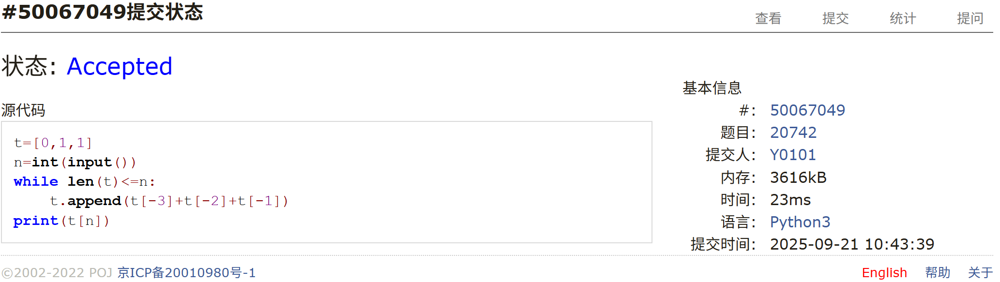
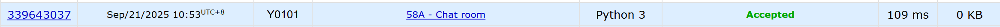
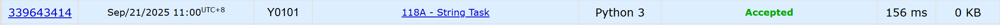
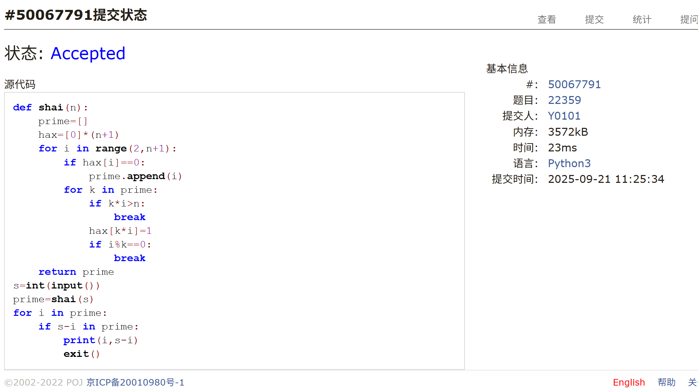
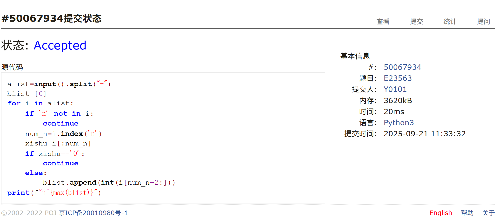
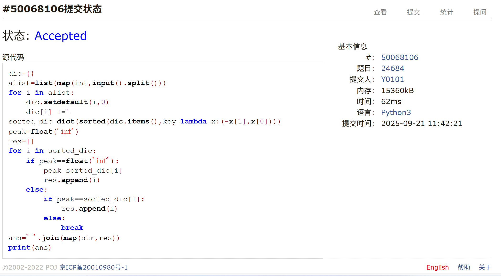

# Assignment #2: DSA & OOP

Updated 1748 GMT+8 Sep 15, 2025

2025 fall, Complied by <mark>杨浩 化院</mark>

## 1. 题目

### 20742: 泰波拿契數

http://cs101.openjudge.cn/practice/20742/

用时：5min

思路：

+ 略

代码：

```python
t=[0,1,1]
n=int(input())
while len(t)<=n:
    t.append(t[-3]+t[-2]+t[-1])
print(t[n])
```


代码运行截图 <mark>（至少包含有"Accepted"）</mark>




### 58A. Chat room

greedy/strings, 1000, http://codeforces.com/problemset/problem/58/A

用时：6min

思路：

+ 略

代码：

```python
s=input()
dic='hello'
t=0
for i in s:
    if i==dic[t]:
        t +=1
    if t==5:
        print('YES')
        exit()
print('NO')

```


代码运行截图 <mark>（至少包含有"Accepted"）</mark>




### 118A. String Task

implementation/strings, 1000, http://codeforces.com/problemset/problem/118/A

用时：5min

思路：

+ 略

代码：

```python
s=input()
s=s.lower()
res=''
yuanyin=['a','o','y','e','u','i']
for i in s:
    if i in yuanyin:
        continue
    else:
        res +=f'.{i}'
print(res)
```


代码运行截图 <mark>（至少包含有"Accepted"）</mark>




### 22359: Goldbach Conjecture

http://cs101.openjudge.cn/practice/22359/

用时：7min

思路：

+ 欧拉筛

代码：

```python
def shai(n):
    prime=[]
    hax=[0]*(n+1)
    for i in range(2,n+1):
        if hax[i]==0:
            prime.append(i)
        for k in prime:
            if k*i>n:
                break
            hax[k*i]=1
            if i%k==0:
                break
    return prime
s=int(input())
prime=shai(s)
for i in prime:
    if s-i in prime:
        print(i,s-i)
        exit()
```


代码运行截图 <mark>（至少包含有"Accepted"）</mark>




### E23563: 多项式时间复杂度

http://cs101.openjudge.cn/pctbook/E23563/

用时：5min

思路：

+ 略

代码

```python
alist=input().split("+")
blist=[0]
for i in alist:
    if 'n' not in i:
        continue
    num_n=i.index('n')
    xishu=i[:num_n]
    if xishu=='0':
        continue
    else:
        blist.append(int(i[num_n+2:]))
print(f"n^{max(blist)}")

```


<mark>（至少包含有"Accepted"）</mark>




### 24684: 直播计票

http://cs101.openjudge.cn/practice/24684/

用时：7min

思路：

+ 略

代码

```python
dic={}
alist=list(map(int,input().split()))
for i in alist:
    dic.setdefault(i,0)
    dic[i] +=1
sorted_dic=dict(sorted(dic.items(),key=lambda x:(-x[1],x[0])))
peak=float('inf')
res=[]
for i in sorted_dic:
    if peak==float('inf'):
        peak=sorted_dic[i]
        res.append(i)
    else:
        if peak==sorted_dic[i]:
            res.append(i)
        else:
            break
ans=' '.join(map(str,res))
print(ans)
```


<mark>（至少包含有"Accepted"）</mark>




## 2. 学习总结和个人收获

本周题目多为复习计概内容，大多是字符串处理难度不大，不过也有收获。写欧拉筛的时候以为自己还能倒背如流，结果，只记住了质数表的倍数要break这一个关键，其余还要仔细回忆，甚至于尝试了几下才能写对。本周还跟着每日选做做了一些堆栈和回溯的题<span style="text-decoration:line-through;">（今日化学那道没绷住）</span>。这些题掌握了堆栈数据类型和递归回溯的方法，难度就不大了，不过细节处理还是要到位，bug也是改了不少。


