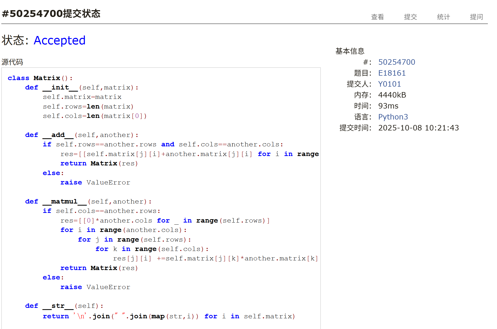
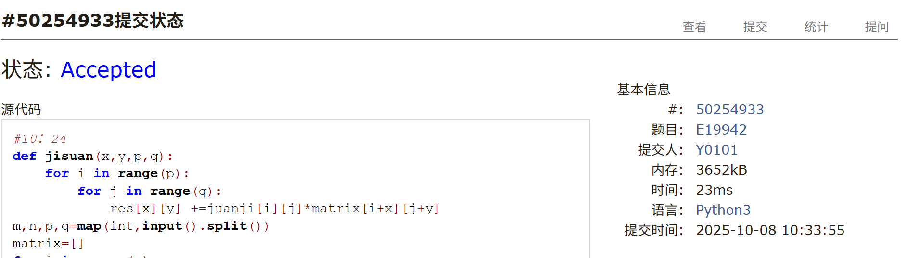
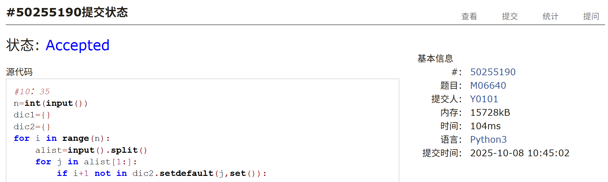
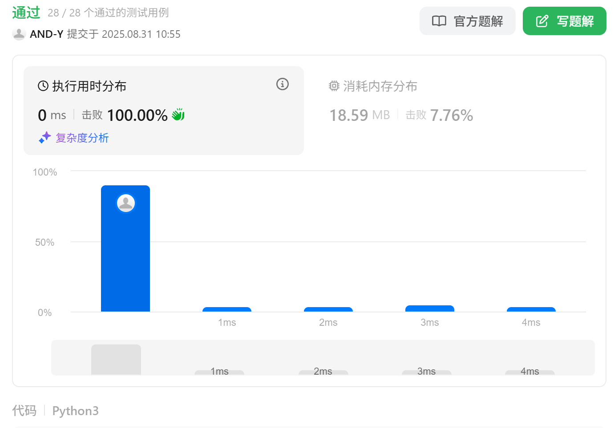
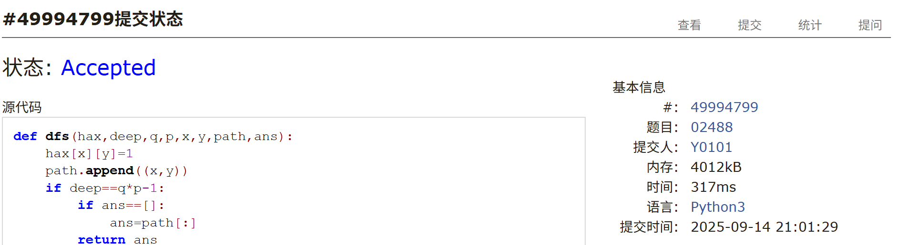

# Assignment #4: Matrix, 链表 & Backtracking

Updated 2226 GMT+8 Sep 29, 2025

2025 fall, Complied by <mark>杨浩、化院</mark>

## 1. 题目

### E18161: 矩阵运算

matrices, http://cs101.openjudge.cn/pctbook/E18161/

请使用`@`矩阵相乘运算符。

用时：15min

思路：

​	定义矩阵加法和乘法，使用@进行矩阵乘法

代码：

```python
class Matrix():
    def __init__(self,matrix):
        self.matrix=matrix
        self.rows=len(matrix)
        self.cols=len(matrix[0])

    def __add__(self,another):
        if self.rows==another.rows and self.cols==another.cols:
            res=[[self.matrix[j][i]+another.matrix[j][i] for i in range(self.cols)] for j in range(self.rows)]
            return Matrix(res)
        else:
            raise ValueError
    
    def __matmul__(self,another):
        if self.cols==another.rows:
            res=[[0]*another.cols for _ in range(self.rows)]
            for i in range(another.cols):
                for j in range(self.rows):
                    for k in range(self.cols):
                        res[j][i] +=self.matrix[j][k]*another.matrix[k][i]
            return Matrix(res)
        else:
            raise ValueError
    
    def __str__(self):
        return '\n'.join(" ".join(map(str,i)) for i in self.matrix)

def readin():
    rows,cols=map(int,input().split())
    matrix=[]
    for i in range(rows):
        matrix.append(list(map(int,input().split())))
    return Matrix(matrix)
if __name__=='__main__':
    a=readin()
    b=readin()
    c=readin()
    try:
        ans=a@b+c
        print(ans)
    except ValueError:
        print('Error!')
```


代码运行截图 <mark>（至少包含有"Accepted"）</mark>




### E19942: 二维矩阵上的卷积运算

matrices, http://cs101.openjudge.cn/pctbook/E19942/

用时：10min

思路：略

代码：

```python
def jisuan(x,y,p,q):
    for i in range(p):
        for j in range(q):
            res[x][y] +=juanji[i][j]*matrix[i+x][j+y]
m,n,p,q=map(int,input().split())
matrix=[]
for i in range(m):
    matrix.append(list(map(int,input().split())))
juanji=[]
for i in range(p):
    juanji.append(list(map(int,input().split())))

res=[[0]*(n+1-q) for _ in range(m+1-p)]
for x in range(m+1-p):
    for y in range(n+1-q):
        jisuan(x,y,p,q)

print('\n'.join(' '.join(map(str,i)) for i in res))
```


代码运行截图 <mark>（至少包含有"Accepted"）</mark>




### M06640: 倒排索引

data structures, http://cs101.openjudge.cn/pctbook/M06640/

用时：10min

思路：

+ 注意同一篇文章中会出现相同的单词

代码：

```python
n=int(input())
dic1={}
dic2={}
for i in range(n):
    alist=input().split()
    for j in alist[1:]:
        if i+1 not in dic2.setdefault(j,set()):
            dic2[j].add(i+1)
            dic1.setdefault(j,[]).append(i+1)

m=int(input())
for i in range(m):
    s=input()
    if s in dic1:
        print(' '.join(map(str,dic1[s])))
    else:
        print('NOT FOUND')
```


代码运行截图 <mark>（至少包含有"Accepted"）</mark>




### E160.相交链表

two pinters, https://leetcode.cn/problems/intersection-of-two-linked-lists/

思路：

+ 初见时使用哈希表，后来训练一些链表题目后使用双指针

代码：

```python
class Solution:
    def getIntersectionNode(self, headA: ListNode, headB: ListNode) -> Optional[ListNode]:
        ptrA, ptrB = headA, headB
        
        while ptrA != ptrB:
            ptrA = ptrA.next if ptrA else headB
            ptrB = ptrB.next if ptrB else headA
        
        return ptrA
```


代码运行截图 <mark>（至少包含有"Accepted"）</mark>


### E206.反转链表

three pinters, recursion, https://leetcode.cn/problems/reverse-linked-list/

思路：

+ 采取三指针迭代法经行处理

代码

```python
class Solution:
    def reverseList(self, head: Optional[ListNode]) -> Optional[ListNode]:
        if head==None or head.next==None:
            return head
        node1=head
        node2=head.next
        head.next=None
        node0=node1
        while node2.next!=None:
            node0=node1
            node1=node2
            node2=node1.next
            node1.next=node0
        if node1.next!=None:    
            node1.next=node0
        node2.next=node1
        return node2
```


<mark>（至少包含有"Accepted"）</mark>




### T02488: A Knight's Journey

backtracking, http://cs101.openjudge.cn/practice/02488/

思路：

+ 注意字典序调整delta内部元组的顺序

代码

```python
def dfs(hax,deep,q,p,x,y,path,ans):
    hax[x][y]=1
    path.append((x,y))
    if deep==q*p-1:
        if ans==[]:
            ans=path[:]
        return ans
    for dx,dy in delta:
        if 0<=x+dx<q and 0<=y+dy<p:
            if hax[x+dx][y+dy]==0:
                ans=dfs(hax,deep+1,q,p,x+dx,y+dy,path,ans)
                if len(ans)!=0:
                    return ans
    hax[x][y]=0
    path.pop()
    return ans

n=int(input())
delta=[(-2,-1),(-2,1),(-1,-2),(-1,2),(1,-2),(1,2),(2,-1),(2,1)]
for i in range(n):
    p,q=map(int,input().split())
    hax=[[0]*p for _ in range(q)]
    ans=[]
    for j in range(q):
        for k in range(p):
            ans=dfs(hax,0,q,p,j,k,[],ans)
            if len(ans)!=0:
                break
        if len(ans)!=0:
            break
    print(f'Scenario #{i+1}:')
    if len(ans)==0:
        print('impossible')
    else:
        res=''
        for zimu,num in ans:
            res +=chr(zimu+65)
            res +=str(num+1)
        print(res)
    if i!=n-1:
        print()
```


<mark>（至少包含有"Accepted"）</mark>




## 2. 学习总结和个人收获

<mark>如果发现作业题目相对简单，有否寻找额外的练习题目，如“数算2025fall每日选做”、LeetCode、Codeforces、洛谷等网站上的题目。</mark>

在LeetCode上练习递归，回溯，dfs题目，这部分的题目大部分都可以AC了，但用时普遍还较长，需要进一步训练。完成作业和每日选作时，自己写完代码AC后学习答案优化代码，同时学习一些自己不会用的函数和方法。


