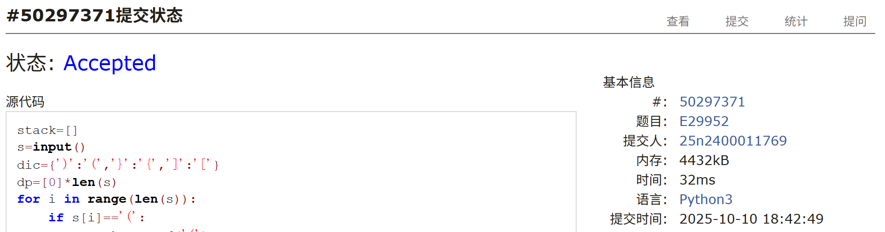
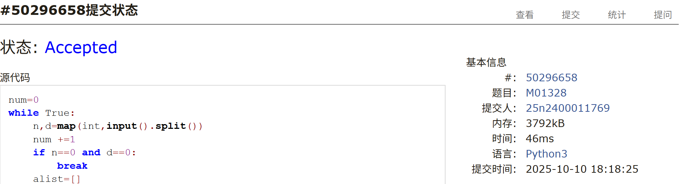
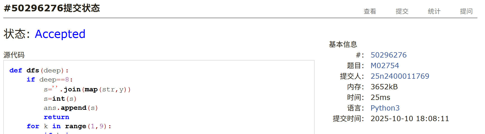
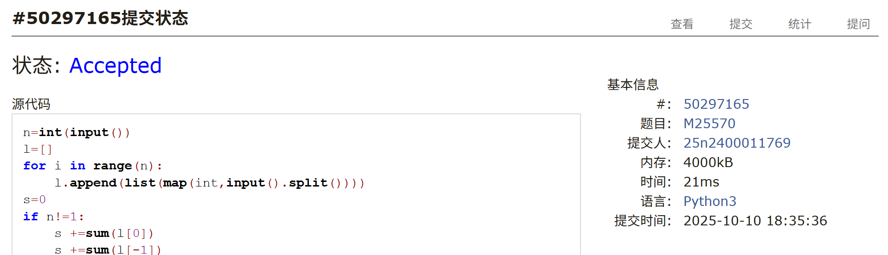
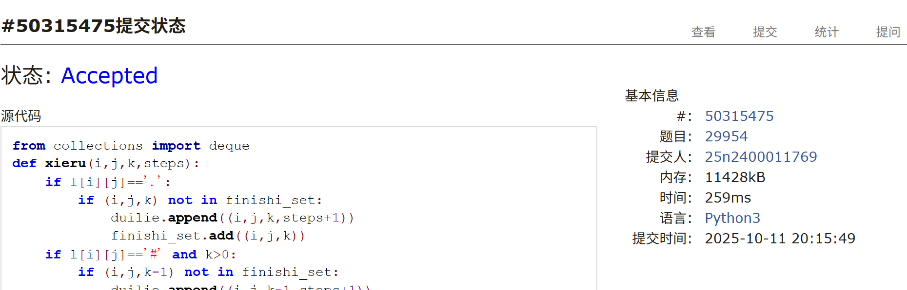
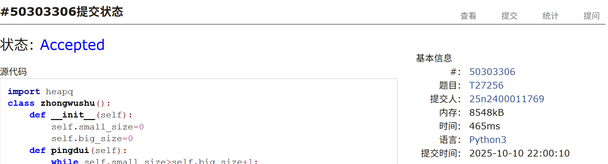

# Assignment #5: cs201 Mock Exam寒露第三天

Updated 1913 GMT+8 Oct 10, 2025

2025 fall, Complied by <mark>杨浩、化院</mark>

## 1. 题目

### E29952: 咒语序列

Stack, http://cs101.openjudge.cn/practice/29952/

思路：

+ 栈+动规

代码：

```python
stack=[]
s=input()
dic={')':'(','}':'{',']':'['}
dp=[0]*len(s)
for i in range(len(s)):
    if s[i]=='(':
        stack.append('(')
    elif s[i]=='[':
        stack.append('[')
    elif s[i]=='{':
        stack.append('{')
    else:
        if not stack:
            continue
        if stack[-1]==dic[s[i]]:
            stack.pop()
            dp[i]=dp[i-1]+2
            if i-dp[i]>=0:
                dp[i]+=dp[i-dp[i]]
print(max(dp))
```


代码运行截图 <mark>（至少包含有"Accepted"）</mark>




### M01328: Radar Installation

greedy, http://cs101.openjudge.cn/practice/01328/


思路：

+ 贪心

代码：

```python
num=0
while True:
    n,d=map(int,input().split())
    num +=1
    if n==0 and d==0:
        break
    alist=[]
    blist=[]
    maxi=0
    for i in range(n):
        alist.append(tuple(map(int,input().split())))
        maxi=max(maxi,alist[-1][1])
    if maxi>d:
        res=-1
    else:
        for x,y in alist:
            r=(d*d-y*y)**0.5
            blist.append((x-r,x+r))
        blist.sort(key=lambda x:x[1])
        res=1
        begin=blist[0][1]
        for i in blist:
            if i[0]>begin:
                res +=1
                begin=i[1]

    print(f'Case {num}: {res}')
    input()
```


代码运行截图 <mark>（至少包含有"Accepted"）</mark>




### M02754: 八皇后

dfs, http://cs101.openjudge.cn/practice/02754/

思路：

+ 回溯

代码：

```python
def dfs(deep):
    if deep==8:
        s=''.join(map(str,y))
        s=int(s)
        ans.append(s)
        return
    for k in range(1,9):
        if k in y:
            continue
        else:
            judge=True
            dj=0
            dk=1
            for t in range(len(y)):
                dj=t-(deep)
                dk=y[t]-k
                if dj==dk or dj+dk==0:
                    judge=False
            if judge:
                y.append(k)
                dfs(deep+1)
                y.pop()

ans=[]
y=[]
dfs(0)
n=int(input())
for i in range(n):
    a=int(input())
    print(ans[a-1])
```


代码运行截图 <mark>（至少包含有"Accepted"）</mark>




### M25570: 洋葱

matrices, http://cs101.openjudge.cn/practice/25570/

思路：


代码：

```python
n=int(input())
l=[]
for i in range(n):
    l.append(list(map(int,input().split())))
s=0
if n!=1:
    s +=sum(l[0])
    s +=sum(l[-1])
    for i in range(1,n-1):
        s=s+l[i][0]+l[i][-1]
maxi=s
if n%2==0:
    for i in range(1,n//2):
        s=0
        s +=sum(l[i][i:-i])
        s +=sum(l[-1-i][i:-i])
        for j in range(i+1,n-i-1):
            s +=l[j][i]
            s +=l[j][-i-1]
        maxi=max(maxi,s)
else:
    for i in range(1,n//2):
        s=0
        s +=sum(l[i][i:-i])
        s +=sum(l[-1-i][i:-i])
        for j in range(i+1,n-i-1):
            s +=l[j][i]
            s +=l[j][-i-1]
        maxi=max(maxi,s)
    maxi=max(maxi,l[(n)//2][(n)//2])

print(maxi)
```


代码运行截图 <mark>（至少包含有"Accepted"）</mark>




### M29954: 逃离紫罗兰监狱

bfs, http://cs101.openjudge.cn/practice/29954/

思路：

+ bfs+集合优化队列时间和内存

代码

```python
from collections import deque
def xieru(i,j,k,steps):
    if l[i][j]=='.':
        if (i,j,k) not in finishi_set:
            duilie.append((i,j,k,steps+1))
            finishi_set.add((i,j,k))
    if l[i][j]=='#' and k>0:
        if (i,j,k-1) not in finishi_set:
            duilie.append((i,j,k-1,steps+1))
            finishi_set.add((i,j,k-1))
    if l[i][j]=='E':
        return True
    return False


r,c,k=map(int,input().split())
l=[]
for i in range(r):
    l.append(input())
    for j in range(c):
        if l[-1][j]=='S':
            begin=(i,j)
duilie=deque([(begin[0],begin[1],k,0)])
finishi_set={(begin[0],begin[1],k)}
huitou_set=set()
delta=[(0,1),(0,-1),(1,0),(-1,0)]
while duilie:
    t=duilie.popleft()
    huitou_set.add((t[0],t[1]))
    for di,dj in delta:
        if 0<=di+t[0]<r and 0<=dj+t[1]<c:
            if (di+t[0],dj+t[1]) not in huitou_set:
                if xieru(di+t[0],dj+t[1],t[2],t[3]):
                    print(t[3]+1)
                    exit()

print(-1)
```


<mark>（至少包含有"Accepted"）</mark>




### T27256: 当前队列中位数

backtracking, http://cs101.openjudge.cn/practice/27256/

思路：

+ 大小堆+惰性删除

代码

```python
import heapq
class zhongwushu():
    def __init__(self):
        self.small_size=0
        self.big_size=0
    def pingdui(self):
        while self.small_size>self.big_size+1:
            self.weihuduiding()
            t=heapq.heappop(small_heaq)
            heapq.heappush(big_heaq,-t)
            self.small_size -=1
            self.big_size +=1
            self.weihuduiding()
        while self.small_size<self.big_size:
            self.weihuduiding()
            t=heapq.heappop(big_heaq)
            heapq.heappush(small_heaq,-t)
            self.small_size +=1
            self.big_size -=1
            self.weihuduiding()
    def weihuduiding(self):
        while small_heaq:
            t=heapq.heappop(small_heaq)
            if -t in laze_dic:
                laze_dic[-t] -=1
                if laze_dic[-t]==0:
                    laze_dic.pop(-t)
            else:
                heapq.heappush(small_heaq,t)
                break
        while big_heaq:
            t=heapq.heappop(big_heaq)
            if t in laze_dic:
                laze_dic[t] -=1
                if laze_dic[t]==0:
                    laze_dic.pop(t)
            else:
                heapq.heappush(big_heaq,t)
                break
n=int(input())
l=[]
big_heaq=[]
small_heaq=[]
laze_dic={}
deadline=0
m=zhongwushu()
for i in range(n):
    ru=input()
    if ru[0]=='a':
        l.append(int(ru[4:]))
        if m.small_size==0:
            heapq.heappush(small_heaq,-l[-1])
            m.small_size +=1
            m.pingdui()
            continue
        if l[-1]<=-small_heaq[0]:
            heapq.heappush(small_heaq,-l[-1])
            m.small_size +=1
        else:
            heapq.heappush(big_heaq,l[-1])
            m.big_size +=1
        m.pingdui()
    elif ru[0]=='d':
        laze_dic.setdefault(l[deadline],0)
        laze_dic[l[deadline]] +=1
        if l[deadline]>-small_heaq[0]:
            m.big_size -=1
        else:
            m.small_size -=1
        m.pingdui()
        m.weihuduiding()
        deadline +=1
    else:
        if m.small_size==m.big_size:
            mid=(big_heaq[0]-small_heaq[0])/2
            if mid==int(mid):
                mid=int(mid)
        else:
            mid=-small_heaq[0]
        print(mid)
```


<mark>（至少包含有"Accepted"）</mark>




## 2. 学习总结和个人收获

月考的时候上来被第一题卡了一会，虽然是做过的题，但考试时动规写错了，还好后来修正过来了。后续的雷达，八皇后以及中位数都是DSA中有过的题，前两个都可以较快速的写出来，最后一个书写量太大了，考场上没写得下来。监狱和传统的bfs有点不同，直接用deque会超内存或者超时，要优化一下。