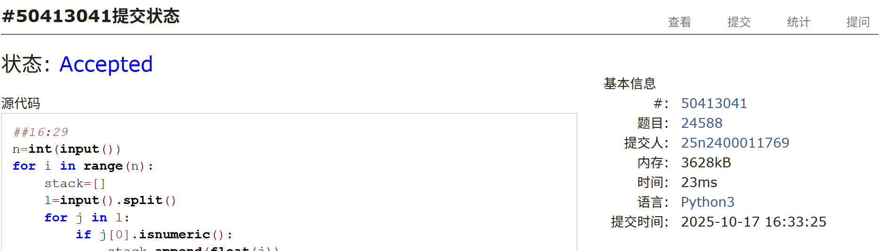
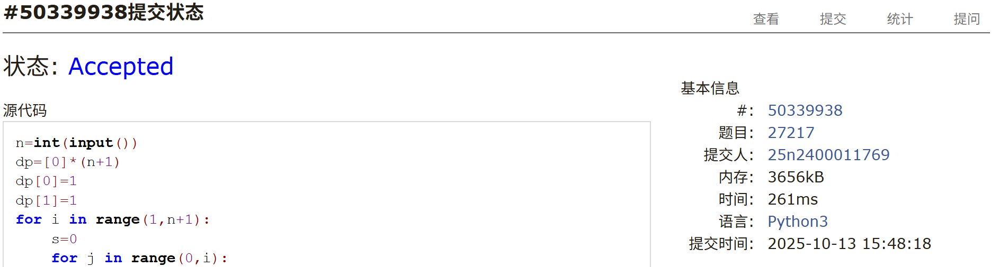
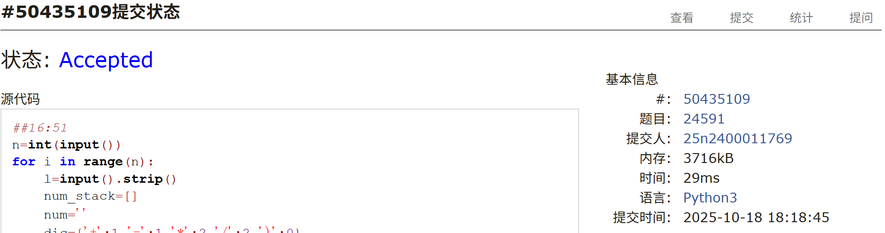
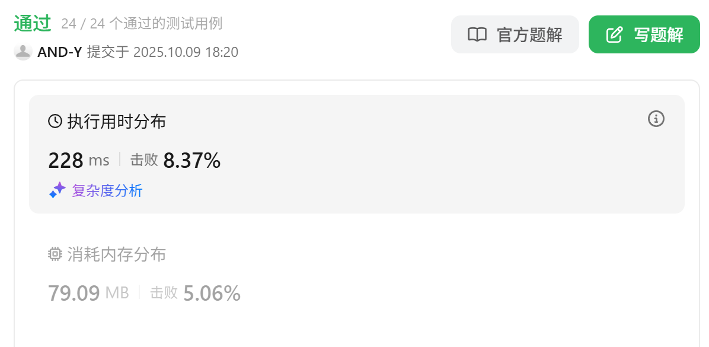

# Assignment #6: 链表、栈和排序

Updated 2143 GMT+8 Oct 13, 2025

2025 fall, Complied by <mark> 杨浩、化院 </mark>

## 1. 题目

### E24588: 后序表达式求值

Stack, http://cs101.openjudge.cn/practice/24588/

用时：5min

思路：略

代码：

```python
n=int(input())
for i in range(n):
    stack=[]
    l=input().split()
    for j in l:
        if j[0].isnumeric():
            stack.append(float(j))
        else:
            if j=='+':
                stack[-2]+=stack[-1]
                stack.pop()
            elif j=='-':
                stack[-2]-=stack[-1]
                stack.pop()
            elif j=='*':
                stack[-2]*=stack[-1]
                stack.pop()
            elif j=='/':
                stack[-2]/=stack[-1]
                stack.pop()
    print(f'{stack[0]:.2f}')
```


代码运行截图 <mark>（至少包含有 "Accepted"）</mark>




### M234.回文链表

linked list, https://leetcode.cn/problems/palindrome-linked-list/

<mark> 请用快慢指针实现 </mark> `O(1)` 空间复杂度。

用时：24min


思路：

+ 快慢指针找到中间点，再把后半段反转

代码：

```python
class Solution:
    def isPalindrome(self, head: Optional[ListNode]) -> bool:
        fast=head
        slow=head
        l=0
        while fast.next:
            fast=fast.next
            slow=slow.next
            l +=1
            if fast.next:
                fast=fast.next
        mid=slow
        pr1=slow
        pr2=slow.next
        while pr2:
            slow=pr2
            pr2=slow.next
            slow.next=pr1
            pr1=slow
        mid.next=None
        while slow:
            if head.val!=slow.val:
                return False
            head=head.next
            slow=slow.next
        return True
```


代码运行截图 <mark>（至少包含有 "Accepted"）</mark>


### M27217: 有多少种合法的出栈顺序

http://cs101.openjudge.cn/practice/27217/

用时：20min

思路：

+ 动规

代码：

```python
n=int(input())
dp=[0]*(n+1)
dp[0]=1
dp[1]=1
for i in range(1,n+1):
    s=0
    for j in range(0,i):
        s+=dp[j]*dp[i-j-1]
    dp[i]=s
print(dp[-1])
```


代码运行截图 <mark>（至少包含有 "Accepted"）</mark>




### M24591: 中序表达式转后序表达式

http://cs101.openjudge.cn/practice/24591/

用时：15min

思路：

+ 栈存在运算符，遇到``')'``弹出直到``'('``

代码

```python
n=int(input())
for i in range(n):
    l=input().strip()
    num_stack=[]
    num=''
    dic={'+':1,'-':1,'*':2,'/':2,')':0}
    for j in l:
        if j.isnumeric():
            num +=j
        elif j=='.':
            num +=j
        else:
            if num:
                num_stack.append(num)
                num=''
            num_stack.append(j)
    if j[0].isnumeric():
        num_stack.append(num)
    stack=[]
    shuchu=[]
    for j in num_stack:
        if j[0].isnumeric():
            shuchu.append(j)
        elif j=='(':
            stack.append('(')
        else: 
            while stack:
                if stack[-1]=='(':
                    break
                t=stack.pop()
                if dic[j]<=dic[t]:
                    shuchu.append(t)
                    continue
                else:
                    stack.append(t)
                    break
            if j!=')':
                stack.append(j)
            else:
                stack.pop()
    while stack:
        shuchu.append(stack[-1])
        stack.pop()
    res=' '.join(shuchu)
    print(res)

```


<mark>（至少包含有 "Accepted"）</mark>




### M02299: Ultra-QuickSort

merge sort, http://cs101.openjudge.cn/practice/02299/

用时:25min

思路：

+ `i<j`且`arr[i]>arr[j]`需要一次交换，否则不需要交换

代码

```python
def merge_count(alist):
    left=0
    right=len(alist)-1
    mid=(left+right)//2
    if right<=0:
        return 0,alist
    elif right==1:
        if alist[0]>alist[1]:
            return 1,[alist[1],alist[0]]
        else:
            return 0,alist
    else:
        left_count,left_arr=merge_count(alist[:mid])
        right_count,right_arr=merge_count(alist[mid:])
        i,j=0,0
        arr=[]
        count=0
        while i<len(left_arr) and j<len(right_arr):
            if left_arr[i]<=right_arr[j]:
                arr.append(left_arr[i])
                i +=1
            else:
                arr.append(right_arr[j])
                j +=1
                count +=len(left_arr)-i
        arr.extend(left_arr[i:])
        arr.extend(right_arr[j:])
        return left_count+count+right_count,arr
while True:
    t=int(input())
    if t==0:
        break
    alist=[]
    for i in range(t):
        alist.append(int(input()))
    print(merge_count(alist)[0])

    
```


<mark>（至少包含有 "Accepted"）</mark>


### M146.LRU 缓存

hash table, doubly-linked list, https://leetcode.cn/problems/lru-cache/

思路：

+ 双端链表

代码：

```python
class node:
    def __init__(self,key):
        self.next=None
        self.last=None
        self.key=key
class LRUCache:
    def __init__(self, capacity: int):
        self.cache={}
        self.capacity=capacity
        self.head=None
        self.end=None
    def get(self, key: int) -> int:
        if key in self.cache:
            if len(self.cache)==1:
                return self.cache[key][0]
            pr=self.cache[key][1]
            if pr.next==None:
                return self.cache[key][0]
            if pr.key!=self.head.key:
                pr.last.next=pr.next
            else:
                self.head=pr.next
            if pr.key!=self.end.key:
                pr.next.last=pr.last
            pr.next=None
            pr.last=self.end
            self.end.next=pr
            self.end=pr
            return self.cache[key][0]       
        else:
            return -1
    def put(self, key: int, value: int) -> None:
        if len(self.cache)==self.capacity and key not in self.cache:
            self.cache.pop(self.head.key)
            self.head=self.head.next
        if key in self.cache:
            if len(self.cache)==1:
                self.cache[key]=(value,node(key))
                return
            pr=self.cache[key][1]
            if pr.next==None:
                self.cache[key]=(value,pr)
                return
            if pr.key!=self.head.key:
                pr.last.next=pr.next
            else:
                self.head=pr.next
            if pr.key!=self.end.key:
                pr.next.last=pr.last
            pr.next=None
            pr.last=self.end
            self.end.next=pr
            self.end=pr
            self.cache[key]=(value,pr)          
        else:
            self.cache[key]=(value,node(key))
            if self.head==None:
                self.head=self.cache[key][1]
                self.end=self.cache[key][1]
            else:
                self.end.next=self.cache[key][1]
                self.cache[key][1].last=self.end
                self.end=self.end.next
```


代码运行截图 <mark>（至少包含有 "Accepted"）</mark>



## 2. 学习总结和个人收获

<mark> 如果发现作业题目相对简单，有否寻找额外的练习题目，如“数算 2025fall 每日选做”、LeetCode、Codeforces、洛谷等网站上的题目。</mark>

本周在Leetcode上练习了一些链表、栈、二叉树等数据结构的题，很多题目初见时都挺有难度的，掌握方法和技巧（如链表的快慢指针）后就大同小异了。