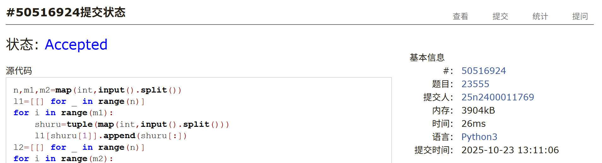

# Assignment #7: bfs、🌲

Updated 0851 GMT+8 Oct 21, 2025

2025 fall, Complied by <mark>杨浩、化院</mark>

## 1. 题目

### M23555: 节省存储的矩阵乘法

implementation, matrices, http://cs101.openjudge.cn/practice/23555

要求用节省内存的方式实现，不能还原矩阵的方式实现。

思路：

+ 两个矩阵一个按行存，一个按列存

代码：

```python
n,m1,m2=map(int,input().split())
l1=[[] for _ in range(n)]
for i in range(m1):
    shuru=tuple(map(int,input().split()))
    l1[shuru[1]].append(shuru[:])
l2=[[] for _ in range(n)]
for i in range(m2):
    shuru=tuple(map(int,input().split()))
    l2[shuru[0]].append(shuru[:])   
ans={}
for i in range(n):
    for j in l1[i]:
        for k in l2[i]:
            ans.setdefault((j[0],k[1]),0)
            ans[(j[0],k[1])] +=j[2]*k[2]
res=sorted(list(ans.items()),key=lambda x:(x[0][0],x[0][1]))
for i in res:
    print(f'{i[0][0]} {i[0][1]} {i[1]}')
```


代码运行截图 <mark>（至少包含有"Accepted"）</mark>




### M102.二叉树的层序遍历

bfs, https://leetcode.cn/problems/binary-tree-level-order-traversal/


思路：

+ bfs

代码：

```python
class Solution:
    def levelOrder(self, root: Optional[TreeNode]) -> List[List[int]]:
        l=deque([])
        if root==None:
            return []
        l.append((root,1))
        res=[]
        while l:
            t=l.popleft()
            if len(res)<t[1]:
                res.append([])
            res[-1].append(t[0].val)
            if t[0].left:
                l.append((t[0].left,t[1]+1))
            if t[0].right:
                l.append((t[0].right,t[1]+1))
        return res
```


代码运行截图 <mark>（至少包含有"Accepted"）</mark>


### M131.分割回文串

dp, backtracking, https://leetcode.cn/problems/palindrome-partitioning/

思路：

+ 回溯+dfs

代码：

```python
class Solution:
    def partition(self, s: str) -> List[List[str]]:
        res=[]
        def check(astr):
            if astr[::-1]==astr:
                return True
            else:
                return False
        def dfs(s,res,path,deep,size):
            if s=='':
                res.append(path[:])
                return
            for i in range(1,size+1):
                a=s[:i]
                if check(a):
                    path.append(a)
                    dfs(s[i:],res,path,deep,len(s[i:]))
                    path.pop()

            
        dfs(s,res,[],0,len(s))
        return res
```


代码运行截图 <mark>（至少包含有"Accepted"）</mark>


### M200.岛屿数量

dfs, bfs, https://leetcode.cn/problems/number-of-islands/ 

思路：

+ bfs

代码

```python
class Solution:
    def numIslands(self, grid: List[List[str]]) -> int:
        def bfs(alist,m,n):
            blist=[]
            for x,y in alist:
                for dx,dy in delta:
                    if 0<=x+dx<m and 0<=y+dy<n:
                        if grid[x+dx][y+dy]=='1':
                            blist.append((x+dx,y+dy))
                            grid[x+dx][y+dy]='0'
            if blist:
                bfs(blist,m,n)
        num=0
        m=len(grid)
        n=len(grid[0])
        delta=[(0,1),(0,-1),(1,0),(-1,0)]
        for i in range(len(grid)):
            for j in range(len(grid[0])):
                if grid[i][j]=='1':
                    num +=1
                    grid[i][j]='0'
                    bfs([(i,j)],m,n)
        return num
```


<mark>（至少包含有"Accepted"）</mark>


### 1123.最深叶节点的最近公共祖先

dfs, https://leetcode.cn/problems/lowest-common-ancestor-of-deepest-leaves/

思路：

+ 先用bfs找到最深叶节点再遍历最近公共祖先

代码

```python
class Solution:
    def lcaDeepestLeaves(self, root: Optional[TreeNode]) -> Optional[TreeNode]:
        duilie=deque([[root]])
        ans=[]
        deep=0
        while duilie:
            if deep<len(duilie[0]):
                deep+=1
                ans=list(duilie)
            l=duilie.popleft()
            pr=l[-1]
            if pr.left:
                res=l[:]
                res.append(pr.left)
                duilie.append(res[:])
            if pr.right:
                res=l[:]
                res.append(pr.right)
                duilie.append(res[:])
        for i in range(deep):
            t=ans[0][i]
            for j in ans:
                if j[i]!=t:
                    return j[i-1]
        return t
```


<mark>（至少包含有"Accepted"）</mark>


### M79.单词搜索

回溯，https://leetcode.cn/problems/word-search/

思路：

+ dfs

代码：

```python
class Solution:
    def exist(self, board: List[List[str]], word: str) -> bool:
        def dfs(word,x,y,m,n,deep):
            if deep==len(word):
                return True
            else:
                for dx,dy in delta:
                    if 0<=x+dx<m and 0<=y+dy<n:
                        if hax[x+dx][y+dy] and board[x+dx][y+dy]==word[deep]:
                            hax[x+dx][y+dy]=False
                            if dfs(word,x+dx,y+dy,m,n,deep+1):
                                return True
                            hax[x+dx][y+dy]=True
        m=len(board)
        n=len(board[0])
        hax=[[True for __ in range(n)] for _ in range(m)]
        begin=[]
        for i in range(m):
            for j in range(n):
                if board[i][j] not in word:
                    hax[i][j]=False
                if board[i][j]==word[0]:
                    begin.append((i,j))
        delta=[(0,1),(0,-1),(1,0),(-1,0)]
        for i,j in begin:
            hax[i][j]=False
            if dfs(word,i,j,m,n,1):
                return True
            hax[i][j]=True
        return False
```


代码运行截图 <mark>（至少包含有"Accepted"）</mark>


## 2. 学习总结和个人收获

学习了二叉树的前序、中序、后序遍历。实现不同树的不同功能需要使用这三种遍历方法。二叉搜索树使用中序遍历可以按大小顺序遍历，后序遍历可以用于找二叉树的直径。现阶段可以顺利地写出递归来解决问题，但自己写出来的递归通常很冗长，不够简洁优雅。


