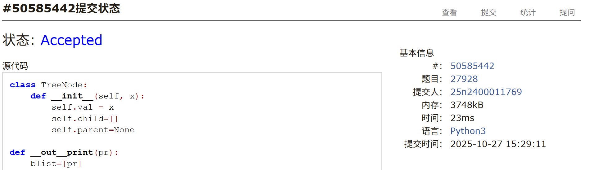
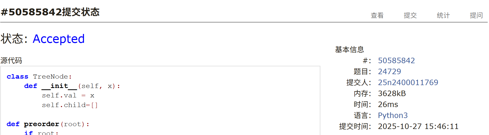

# Assignment #8: 🌲 (2/3)

Updated 2223 GMT+8 Oct 27, 2025

2025 fall, Complied by <mark>杨浩、化院</mark>

## 1. 题目

### E108.将有序数组转换为二叉搜索树

https://leetcode.cn/problems/convert-sorted-array-to-binary-search-tree/

思路：

+ 二分

代码：

```python
class Solution:
    def sortedArrayToBST(self, nums: List[int]) -> Optional[TreeNode]:
        def gouzao(alist):
            if alist:
                mid=(len(alist)-1)//2
                pr=TreeNode(alist[mid],gouzao(alist[:mid]),gouzao(alist[mid+1:]))
                return pr
            else:
                return None
        return gouzao(nums)
```


代码运行截图 <mark>（至少包含有"Accepted"）</mark>


### M07161: 森林的带度数层次序列存储

tree, http://cs101.openjudge.cn/practice/07161/


思路：

一开始第16行的`while cnt==0 and alist:`写成了`if cnt==0:`，WA不了，把`build_tree()`换了一个写法就AC，找了半天才看到`while`写成`if`了。

代码：

```python
from collections import deque
class TreeNode:
    def __init__(self,val=None):
        self.val=val
        self.children=[]
def build_tree():
    root=TreeNode(l[0])
    cnt=int(l[1])
    alist=deque([(root,cnt)])
    pr,cnt=alist.popleft()
    for j in range(2,len(l),2):
        alist.append((TreeNode(l[j]), int(l[j + 1])))
        if cnt>0:
            cnt-=1
            pr.children.append(alist[-1][0])
        while cnt==0 and alist:
            pr,cnt=alist.popleft()

    return root

'''换了一种写法就AC了...
def build_tree():
    root = TreeNode(l[0])
    alist = deque([(root, int(l[1]))])
    j = 2

    while j<len(l):
        pr,cnt=alist[0]
        if cnt==0:
            alist.popleft()
            continue
        pr.children.append(TreeNode(l[j]))
        if int(l[j+1])> 0:
            alist.append((pr.children[-1], int(l[j + 1])))
        alist[0]=(pr,cnt-1)
        j += 2

    return root
'''
def postorder(root):
    if root:
        for child in root.children:
            postorder(child)
        res.append(root.val)
n=int(input())
res=[]
for i in range(n):
    l=list(input().split())
    root = build_tree()
    postorder(root)
print(' '.join(res))
```


代码运行截图 <mark>（至少包含有"Accepted"）</mark>


### M27928: 遍历树

 adjacency list, dfs, http://cs101.openjudge.cn/practice/27928/

思路：

+ 递归遍历即可

代码：

```python
class TreeNode:
    def __init__(self, x):
        self.val = x
        self.child=[]
        self.parent=None

def __out__print(pr):
    blist=[pr]
    blist+=pr.child
    blist.sort(key=lambda x:x.val)
    for i in blist:
        if i!=pr:
            __out__print(i)
        else:
            print(i.val)
n=int(input())
pr_dic={}
for i in range(n):
    alist=list(map(int,input().split()))
    if alist[0] in pr_dic:
        pr=pr_dic[alist[0]]
    else:
        pr=TreeNode(alist[0])
        pr_dic[alist[0]]=pr
    for j in alist[1:]:
        if j not in pr_dic:
            pr_dic[j]=TreeNode(j)
        pr.child.append(pr_dic[j])
        pr_dic[j].parent=pr
root=pr_dic[alist[0]]
while root.parent:
    root=root.parent
__out__print(root)
```


代码运行截图 <mark>（至少包含有"Accepted"）</mark>




### M129.求根节点到叶节点数字之和

dfs, https://leetcode.cn/problems/sum-root-to-leaf-numbers/

思路：

+ dfs

代码

```python
class Solution:
    def sumNumbers(self, root: Optional[TreeNode]) -> int:
        def dfs(pr,path):
            if pr:
                path.append(pr.val)
                if pr.left:
                    dfs(pr.left,path)
                if pr.right:
                    dfs(pr.right,path)
                if not pr.left and not pr.right:
                    res.append(int(''.join(list(map(str,path)))))
                path.pop()
        res=[]
        dfs(root,[])
        return sum(res)
```


代码运行截图<mark>（至少包含有"Accepted"）</mark>


### M24729: 括号嵌套树

dfs, stack, http://cs101.openjudge.cn/practice/24729/

思路：

代码

```python
class TreeNode:
    def __init__(self, x):
        self.val = x
        self.child=[]

def preorder(root):
    if root:
        pre_res.append(root.val)
        for i in root.child:
            preorder(i)
def inorder(root):
    if root:
        for i in root.child:
            inorder(i)
        in_res.append(root.val)

data=input()
root=TreeNode(data[0])
stack=[]
pr=root
for i in data[1:]:
    if i=='(':
        stack.append(pr)
    elif i==')':
        stack.pop()
    elif i==',':
        pass
    else:
        stack[-1].child.append(TreeNode(i))
        pr=stack[-1].child[-1]
pre_res=[]
preorder(root)
print(''.join(pre_res))
in_res=[]
inorder(root)
print(''.join(in_res))
```


代码运行截图<mark>（至少包含有"Accepted"）</mark>




### T02775: 文件结构“图”

tree, http://cs101.openjudge.cn/practice/02775/

思路：

代码：

```python
class TreeNode:
    def __init__(self,name:str,deep:int):
        self.name=name
        self.dir__children=[]
        self.file__children=[]
        self.deep=deep
    def __out__(self):
        predix='|     '*self.deep
        print(predix+self.name)
        for i in self.dir__children:
            i.__out__()
        self.file__children.sort()
        for i in self.file__children:
            print(predix+i)

cnt=0
root=TreeNode('ROOT',0)
stack=[root]
while True:
    l=input()
    if l=='*':
        cnt+=1
        print(f'DATA SET {cnt}:')
        root.__out__()
        root=TreeNode('ROOT',0)
        stack=[root]
        print()
    elif l=='#':
        break
    elif l==']':
        stack.pop()
    elif l[0]=='d':
        stack[-1].dir__children.append(TreeNode(l,stack[-1].deep+1))
        stack.append(stack[-1].dir__children[-1])
    elif l[0]=='f':
        stack[-1].file__children.append(l)
```


代码运行截图 <mark>（至少包含有"Accepted"）</mark>


## 2. 学习总结和个人收获

树部分的题目模板性很强，进过一定量题目训练，熟练写递归后，做起来新题目来还是比较轻松的。LeetCode上热题100里数据结构的题这周彻底做完了，计划继续练习更为复杂的树的题目。