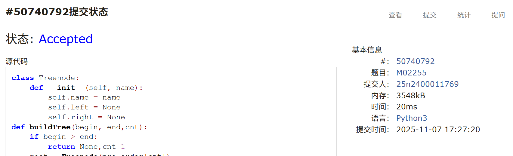
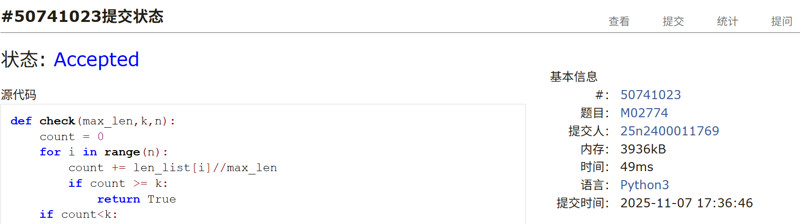
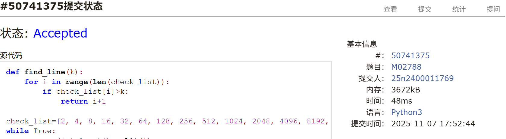
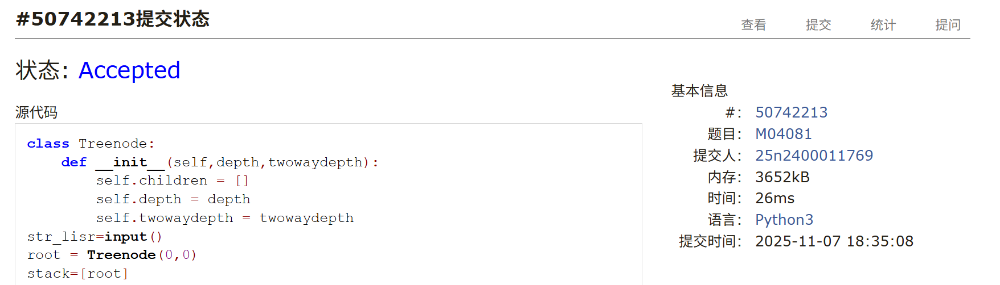
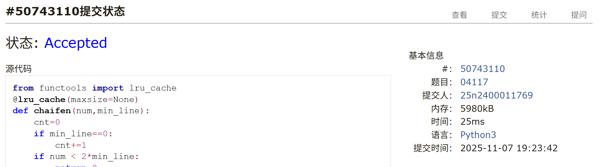
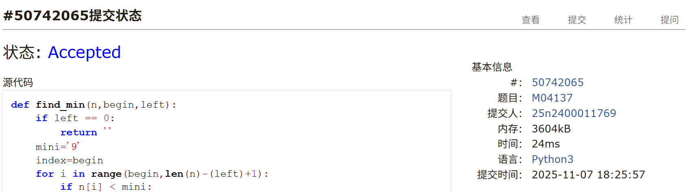

# Assignment #9: Mock Exam立冬

Updated 1856 GMT+8 Nov 7, 2025

2025 fall, Complied by <mark>杨浩、化院</mark>


>**说明：**
>
>1. Nov⽉考： AC5<mark>（请改为同学的通过数）</mark> 。考试题⽬都在“题库（包括计概、数算题目）”⾥⾯，按照数字题号能找到，可以重新提交。作业中提交⾃⼰最满意版本的代码和截图。
>
>2. 解题与记录：对于每一个题目，请提供其解题思路（可选），并附上使用Python或C++编写的源代码（确保已在OpenJudge， Codeforces，LeetCode等平台上获得Accepted）。请将这些信息连同显示“Accepted”的截图一起填写到下方的作业模板中。（推荐使用Typora https://typoraio.cn 进行编辑，当然你也可以选择Word。）无论题目是否已通过，请标明每个题目大致花费的时间。
>
>3. 提交安排：提交时，请首先上传PDF格式的文件，并将.md或.doc格式的文件作为附件上传至右侧的“作业评论”区。确保你的Canvas账户有一个清晰可见的本人头像，提交的文件为PDF格式，并且“作业评论”区包含上传的.md或.doc附件。
>
>4. 延迟提交：如果你预计无法在截止日期前提交作业，请提前告知具体原因。这有助于我们了解情况并可能为你提供适当的延期或其他帮助。  
>
>请按照上述指导认真准备和提交作业，以保证顺利完成课程要求。


## 1. 题目

### M02255: 重建二叉树

http://cs101.openjudge.cn/practice/02255/

思路：

+ 前序顺序遍历构造树根，中序序列以树根分割左右子树

代码

```python
class Treenode:
    def __init__(self, name):
        self.name = name
        self.left = None
        self.right = None
def buildTree(begin, end,cnt):
    if begin > end:
        return None,cnt-1
    root = Treenode(pre_order[cnt])
    for i in range(begin, end+1):
        if in_order[i]==root.name:
            root.left,cnt = buildTree(begin, i-1,cnt+1)
            root.right,cnt = buildTree(i+1, end,cnt+1)
    return root,cnt
def postorder(root):
    if root:
        postorder(root.left)
        postorder(root.right)
        res.append(root.name)


while True:
    try:
        pre_order,in_order = input().split()
        pre_order = list(pre_order)
        in_order = list(in_order)
        root,cnt=buildTree(0,len(in_order)-1,0)
        res=[]
        postorder(root)
        print(''.join(res))
    except EOFError:
        break
```


代码运行截图 <mark>（至少包含有"Accepted"）</mark>




### M02774: 木材加工

http://cs101.openjudge.cn/practice/02774/

思路：

+ 二分查找，0单独讨论

代码

```python
def check(max_len,k,n):
    count = 0
    for i in range(n):
        count += len_list[i]//max_len
        if count >= k:
            return True
    if count<k:
        return False
    else:
        return True
def fen(k,n):
    if sum(len_list)<k:
        return 0
    left=1
    right=max(len_list)
    while left<=right:
        mid=(left+right)//2
        if check(mid,k,n):
            left=mid+1
        else:
            right=mid-1
    return right


n,k=map(int,input().split())
len_list=[]
for i in range(n):
    len_list.append(int(input()))
print(fen(k,n))
```


代码运行截图 <mark>（至少包含有"Accepted"）</mark>




### M02788: 二叉树（2）

http://cs101.openjudge.cn/practice/02788/

思路：

+ 此问题中的一个满二叉树，树根为`x`，最左边的叶子节点为`x*2**n`，最右边的叶子节点为`（x+1）*2**n-1`

代码

```python
def find_line(k):
    for i in range(len(check_list)):
        if check_list[i]>k:
            return i+1

check_list=[2, 4, 8, 16, 32, 64, 128, 256, 512, 1024, 2048, 4096, 8192, 16384, 32768, 65536, 131072, 262144, 524288, 1048576, 2097152, 4194304, 8388608, 16777216, 33554432, 67108864, 134217728, 268435456, 536870912, 1073741824]
while True:
    m,n=map(int,input().split())
    if m==0 and n==0:
        break
    m_line=find_line(m)
    n_line=find_line(n)
    count_line=n_line-m_line
    if count_line==0:
        print(1)
        continue
    count=2**count_line-1
    left=m*2**count_line
    right=(m+1)*2**count_line-1
    if right<=n:
        print(2**(count_line+1)-1)
        continue
    elif left<=n:
        print(count+(n-left)+1)
        continue
    else:
        print(count)
        continue
```


代码运行截图 <mark>（至少包含有"Accepted"）</mark>




### M04081: 树的转换

http://cs101.openjudge.cn/practice/04081/


思路：

+ 利用`stack`构造一个树，分别记录树的深度和对应二叉树深度。根据父节点是否已有子节点判断二叉树深度为上一个子节点+1还是父节点+1。

代码

```python
class Treenode:
    def __init__(self,depth,twowaydepth):
        self.children = []
        self.depth = depth
        self.twowaydepth = twowaydepth
str_lisr=input()
root = Treenode(0,0)
stack=[root]
max_depth=0
max_twowaydepth=0
for i in str_lisr:
    if i=='d':
        pr=Treenode(stack[-1].depth+1,0)
        if stack[-1].children:
            twowaydepth=stack[-1].children[-1].twowaydepth+1
        else:
            twowaydepth=stack[-1].twowaydepth+1
        pr.twowaydepth=twowaydepth
        max_depth=max(max_depth,pr.depth)
        max_twowaydepth=max(max_twowaydepth,twowaydepth)
        stack[-1].children.append(pr)
        stack.append(pr)
    else:
        stack.pop()
print(f'{max_depth} => {max_twowaydepth}')

```


代码运行截图 <mark>（至少包含有"Accepted"）</mark>




### M04117: 简单的整数划分问题

dfs, dp, http://cs101.openjudge.cn/practice/04117/

思路：

+ 题干说有多组数据，虽然样例只有一组，但不用`try``except`会WA。

+ 需要不重不漏的找拆分。先将一个数分成大小两个数`A`,`B`（可以取等），然后将大的数`A`递归，继续分解且要求大的数`A`分解出来的两个数`C`、`D`满足：较小的`D`大于等于`B`。最初拆分的时候可以取`B==0`且这组拆分不进行递归，但之后的拆分均要求`B>=1`。

+ 这个拆分的正确性判断思路如下：

  + 维持拆分数列的有序性是这个方法的关键

  + 举`n==5`的例子说明，首先可以分解为`[5]`（这组不参与后续拆分）,`[4,1]`,`[3,2]`拆成2个数做到了不重不漏。
  + 拆解为3个数的所有拆法一定可以从2个数中分解1个数实现（逆向更好说明，3个数中任意找2个数合并后剩下的2个数一定存在于拆成2个数的拆法中）。
  + 限制大数分解出来的小数大小（即`A`分解出来的两个数`C`、`D`满足：较小的`D`大于等于`B`），可以实现不重。例如，若将`[3,2]`拆为`[2,1,2]`即`[2,2,1]`一定可以合并为`[4,1]`。即不满足大数拆解条件一定会出现重复计数。
  + 拆解到3个数时有`[3,1,1]`,`[2,2,1]`。可以想象假设有更多的数[…..,a,b,…..]（k个数）不拆分第一个数，拆分后面的数为[……,a,m,n…..]（k+1个），重新排序，并将最大的两个数合并，这个拆法一定会先k个数中第一个数更大的情况中出现，也就说明将后面b拆分为m+n也会重复。即不拆第一个数也会重复。
  + 综上，将第一个数拆分，并满足限制大数分解出来的小数大小（即`A`分解出来的两个数`C`、`D`满足：较小的`D`大于等于`B`）条件就不重复，依次遍历就可以得到全部答案。

代码

```python
from functools import lru_cache
@lru_cache(maxsize=None)
def chaifen(num,min_line):
    cnt=0
    if num < 2*min_line:
        return 0
    pr=num-min_line
    if min_line==0:
        pr-=1
        cnt+=1
    while pr>=num-pr:
        cnt+=1+chaifen(pr,num-pr)
        pr-=1
    return cnt
while True:
    try:
        n=int(input())
        print(chaifen(n,0))
    except EOFError:
        break
```


代码运行截图 <mark>（至少包含有"Accepted"）</mark>




### M04137:最小新整数

monotonous-stack, http://cs101.openjudge.cn/practice/04137/

思路：

+ 贪心：假设数为abcdefg，需要去除2个，即需要留下5个，则在前3个（需要保证可以取完5个数）数字abc中选一个最小的数作为最高位，可以使得这步解最优，如果出现相等的数字，则选取最先出现的数字，使得后续的选择得到更优解。

代码

```python
def find_min(n,begin,left):
    if left == 0:
        return ''
    mini='9'
    index=begin
    for i in range(begin,len(n)-(left)+1):
        if n[i] < mini:
            mini = n[i]
            index=i
    return n[index]+find_min(n,index+1,left-1)
t=int(input())
for i in range(t):
    n,k=input().split()
    k=int(k)
    left=len(n)-k
    print(find_min(n,0,left))
```


代码运行截图 <mark>（至少包含有"Accepted"）</mark>




## 2. 学习总结和收获

考试题目AC5个，M04117: 简单的整数划分问题考试的时候没有看见说多组数据，看样例给了一个以为是只有1个，一直WA，下来写一个`try`就AC了。本周考试题目总体难度一般，没有出现T20576: printExp那种庞大书写量的题目。考题思维量也较为正常，不过考题中需要构造树对象的题目不多，一定程度上超出了前期训练时的意料。

树中典型的题目基本都训练过了，接下来的训练可以加大练习题目的书写量和思考量。
