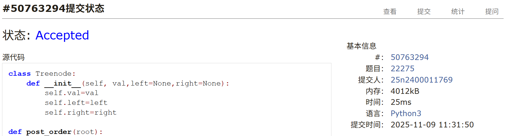
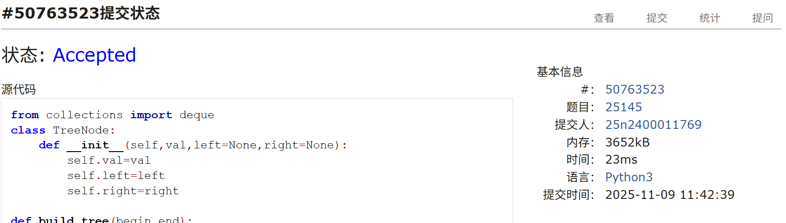
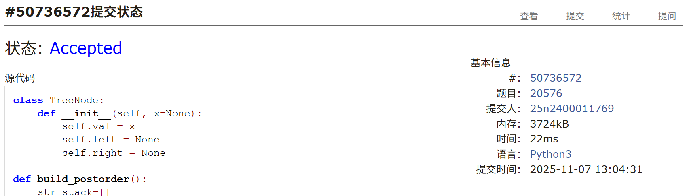
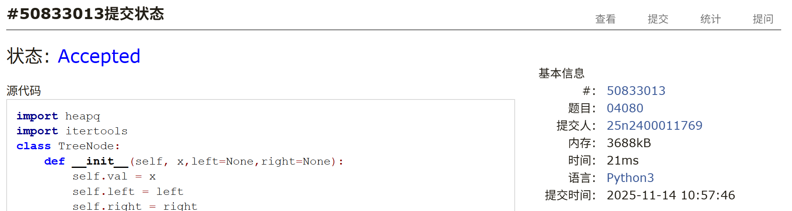
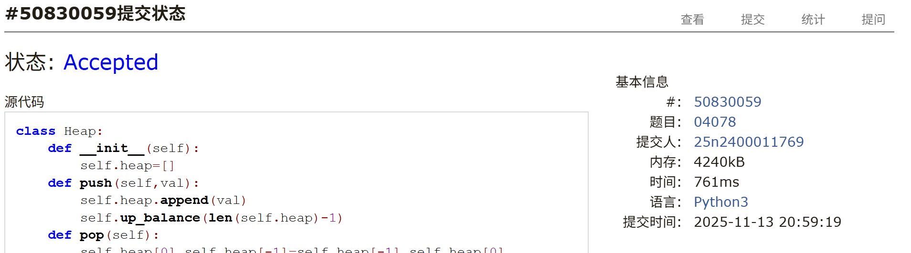

# Assignment #A: 递归回溯、🌲 (3/4)

Updated 2203 GMT+8 Nov 3, 2025

2025 fall, Complied by <mark>同学的姓名、院系</mark>

## 1. 题目

### T51.N皇后

backtracking, https://leetcode.cn/problems/n-queens/

思路：

+ dfs

代码：

```python
class Solution:
    def solveNQueens(self, n: int) -> List[List[str]]:
        

        def dfs(deep,n,res,huanghou):
                if deep==n:
                    res.append(huanghou[:])
                    return
                for i in range(n):
                    if i in huanghou:
                        continue
                    judge=0
                    for j in range(deep):
                        dx=deep-j
                        dy=i-huanghou[j]
                        if dx+dy==0 or dx==dy:
                            judge=1
                            break
                    if judge==1:
                        continue
                    huanghou.append(i)
                    dfs(deep+1,n,res,huanghou)
                    huanghou.pop()
        res=[]
        huanghou=[]    
        dfs(0,n,res,huanghou)
        ans=[]
        for i in range(len(res)):
            qipan=[]
            for j in range(n):
                row=['.']*n
                row[res[i][j]]='Q'
                astr=''.join(row)
                qipan.append(astr)
            ans.append(qipan)


        return ans
```


代码运行截图 <mark>（至少包含有"Accepted"）</mark>


### M22275: 二叉搜索树的遍历

http://cs101.openjudge.cn/practice/22275/


思路：

+ 可以直接给前序序列排序得到中序序列，再构造BST
+ 或者利用stack和BST的有序性来构造BST

代码：

```python
class Treenode:
    def __init__(self, val,left=None,right=None):
        self.val=val
        self.left=left
        self.right=right

def post_order(root):
    if root:
        post_order(root.left)
        post_order(root.right)
        res.append(root.val)


n=int(input())
preorder_list=list(map(int,input().split()))
root = Treenode(preorder_list[0])
stack=[root]
pr=root
for i in preorder_list[1:]:
    if pr.val>i:
        pr.left=Treenode(i)
        stack.append(pr.left)
        pr=pr.left
    else:
        while len(stack)>1 and stack[-2].val<i:
            stack.pop()
        pr=stack.pop()
        pr.right=Treenode(i)
        stack.append(pr.right)
        pr=pr.right

res=[]
post_order(root)
print(*res)
```


代码运行截图 <mark>（至少包含有"Accepted"）</mark>




### M25145: 猜二叉树（按层次遍历）

http://cs101.openjudge.cn/practice/25145/

思路：

+ 略

代码：

```python
from collections import deque
class TreeNode:
    def __init__(self,val,left=None,right=None):
        self.val=val
        self.left=left
        self.right=right

def build_tree(begin,end):
    if begin>end:
        return None
    root=TreeNode(post_order.pop())
    for index in range(begin,end+1):
        if in_order[index]==root.val:
            break
    root.right=build_tree(index+1,end)
    root.left=build_tree(begin,index-1)
    return root

def cengxu(root):
    alist=deque([root])
    res=[]
    while alist:
        t=alist.popleft()
        res.append(t.val)
        if t.left:
            alist.append(t.left)
        if t.right:
            alist.append(t.right)
    return res

n=int(input())
for i in range(n):
    in_order=list(input())
    post_order=list(input())
    root=build_tree(0,len(in_order)-1)
    res=cengxu(root)
    print(''.join(res))
```


代码运行截图 <mark>（至少包含有"Accepted"）</mark>




### T20576: printExp（逆波兰表达式建树）

http://cs101.openjudge.cn/practice/20576/

思路：

+ 中序转后序
+ 后序构造树
+ 运算等级确定是否填括号

代码

```python
class TreeNode:
    def __init__(self, x=None):
        self.val = x
        self.left = None
        self.right = None

def build_postorder():
    str_stack=[]
    postlist=[]
    for i in data:
        if i=='(':
            str_stack.append(i)
        elif i==')':
            t=str_stack.pop()
            while t!='(':
                postlist.append(t)
                t=str_stack.pop()
        elif i=='True' or i=='False':
            postlist.append(i)
        else:
            while str_stack and dic[str_stack[-1]]>=dic[i]:
                t=str_stack.pop()
                postlist.append(t)
            str_stack.append(i)
    while str_stack:
        postlist.append(str_stack.pop())
    return postlist

def build_tree():
    postlist=build_postorder()
    stack=[]
    for val in postlist:
        pr=TreeNode(val)
        if val=='True' or val=='False':
            stack.append(pr)
        elif val=='not':
            pr.left=stack.pop()
            stack.append(pr)
        else:
            pr.right=stack.pop()
            pr.left=stack.pop()
            stack.append(pr)
    return pr

def build_res(root):
    if dic[root.val]==-1:
        return [root.val]
    elif root.val=='not':
        if dic[root.left.val]==-1:
            return  ['not']+build_res(root.left)
        else:
            return ['not','(']+build_res(root.left)+[')']
    elif root.val=='and':
        if dic[root.left.val]==1:
            left=['(']+build_res(root.left)+[')']
        else:
            left=build_res(root.left)
        if dic[root.right.val]==1:
            right=['(']+build_res(root.right)+[')']
        else:
            right=build_res(root.right)
        return left+['and']+right
    else:
         return build_res(root.left)+[root.val]+build_res(root.right)


data=list(input().split())
dic={'not':3,'and':2,'or':1,'(':0,'True':-1,'False':-1}

root=build_tree()
res=build_res(root)
print(*res)
```


代码运行截图<mark>（至少包含有"Accepted"）</mark>




### T04080:Huffman编码树

greedy, http://cs101.openjudge.cn/practice/04080/

思路：

+ 由下至上构造二叉树，再递归求路径和

代码

```python
import heapq
import itertools
class TreeNode:
    def __init__(self, x,left=None,right=None):
        self.val = x
        self.left = left
        self.right = right

def buildTree():
    heap = []
    count=itertools.count()
    for i in num_list:
        pr = TreeNode(i)
        heapq.heappush(heap, (i, next(count),pr))
    while len(heap) > 1:
        left_val , cnt , left = heapq.heappop(heap)
        right_val , cnt , right = heapq.heappop(heap)
        pr = TreeNode(left_val + right_val, left, right)
        heapq.heappush(heap, (pr.val, next(count),pr))
    return heap[0][2]

def cal_min_length(root,deep):
    if not root.left and not root.right:
        return deep*root.val
    return cal_min_length(root.left,deep+1) + cal_min_length(root.right,deep+1)

n=int(input())
num_list=list(map(int,input().split()))
root=buildTree()
print(cal_min_length(root,0))
```


代码运行截图<mark>（至少包含有"Accepted"）</mark>




### M04078: 实现堆结构

http://cs101.openjudge.cn/practice/04078/

要求手搓堆实现。

思路：

+ 略

代码：

```python
class Heap:
    def __init__(self):
        self.heap=[]
    def push(self,val):
        self.heap.append(val)
        self.up_balance(len(self.heap)-1)
    def pop(self):
        self.heap[0],self.heap[-1]=self.heap[-1],self.heap[0]
        t=self.heap.pop()
        self.down_balance(0)
        return t
    def up_balance(self,pr):
        if pr==0:
            return
        parent_index=(pr-1)//2
        if self.heap[parent_index]>self.heap[pr]:
            self.heap[parent_index],self.heap[pr]=self.heap[pr],self.heap[parent_index]
            self.up_balance(parent_index)
        else:
            return
    def down_balance(self,pr):
        left=pr*2+1
        right=pr*2+2
        if left>len(self.heap)-1:
            return
        elif left==len(self.heap)-1:
            if self.heap[left]<self.heap[pr]:
                self.heap[left],self.heap[pr]=self.heap[pr],self.heap[left]
            return
        else:
            if self.heap[pr]<min(self.heap[right],self.heap[left]):
                return
            else:
                if self.heap[left]<self.heap[right]:
                    self.heap[left],self.heap[pr]=self.heap[pr],self.heap[left]
                    self.down_balance(left)
                else:
                    self.heap[right],self.heap[pr]=self.heap[pr],self.heap[right]
                    self.down_balance(right)
n=int(input().strip())
heap=Heap()
for i in range(n):
    l=tuple(map(int,input().strip().split()))
    if l[0]==1:
        heap.push(l[1])
    elif l[0]==2:
        print(heap.pop())
```


代码运行截图 <mark>（至少包含有"Accepted"）</mark>



## 2. 学习总结和个人收获

本周继续练习了一些较为复杂的树的题目。在T04080:Huffman编码树中使用最小堆时，学习了用itertools.count()和next()实现相同元素的比较。在另一个题目22161:哈夫曼编码树，学习了用`__lt__`方法来构造可比较对象，使得可以直接把树的节点放入最小堆中。

