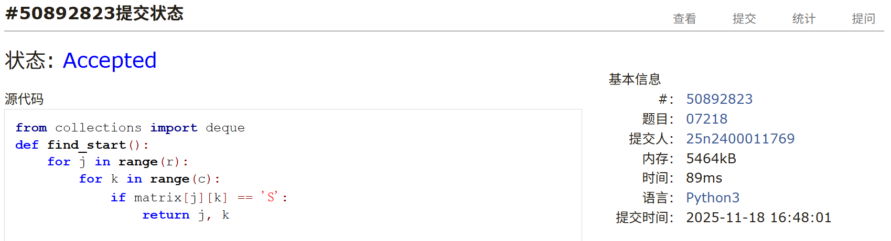
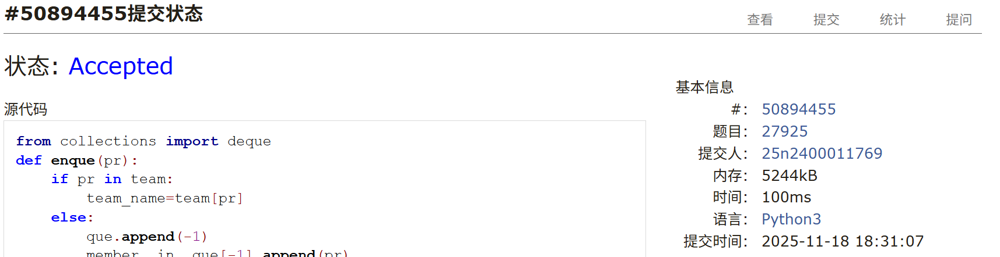
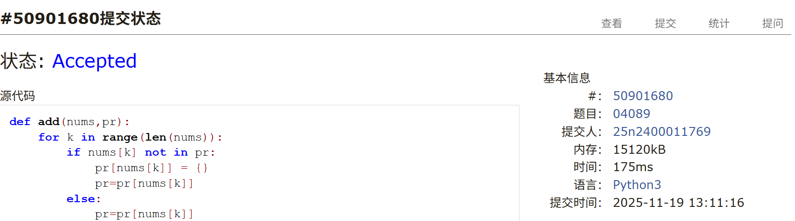

# Assignment #B: 图 (1/4)

Updated 2031 GMT+8 Nov 17, 2025

2025 fall, Complied by <mark>杨浩、化院</mark>

## 1. 题目

### E07218: 献给阿尔吉侬的花束

bfs, http://cs101.openjudge.cn/practice/07218/

思路：

+ 简单的bfs

代码：

```python
from collections import deque
def find_start():
    for j in range(r):
        for k in range(c):
            if matrix[j][k] == 'S':
                return j, k

def bfs(start,r,c):
    queue = deque([(start[0],start[1],0)])
    finished = set()
    finished.add(start)
    delta=[(1,0),(-1,0),(0,1),(0,-1)]
    while queue:
        x,y,steps=queue.popleft()
        for dx,dy in delta:
            if 0<=x+dx<r and 0<=y+dy<c:
                if (x+dx,y+dy) not in finished:
                    finished.add((x+dx,y+dy))
                    if matrix[x+dx][y+dy] == '.':
                        queue.append((x+dx,y+dy,steps+1))
                    if matrix[x+dx][y+dy] == 'E':
                        return str(steps+1)
    return 'oop!'
t=int(input())
for i in range(t):
    r,c=map(int,input().split())
    matrix=[]
    for j in range(r):
        matrix.append(list(input()))
    start=find_start()
    print(bfs(start,r,c))
```


代码运行截图 <mark>（至少包含有"Accepted"）</mark>




### M27925: 小组队列

dict, queue, http://cs101.openjudge.cn/practice/27925/


思路：

+ 构建组员到组的单向图
+ 构建双端链表，把组放进去，在用一个字典实现组到已排队的组员列表的映射
+ 散客放进特殊的组，加入散客时总在组列表中加入散客组

代码：

```python
from collections import deque
def enque(pr):
    if pr in team:
        team_name=team[pr]
    else:
        que.append(-1)
        member__in__que[-1].append(pr)
        return
    if team_name in member__in__que:
        member__in__que[team_name].append(pr)
    else:
        member__in__que[team_name] = deque([pr])
        que.append(team_name)

def de():
    t=que[0]
    if t==-1:
        que.popleft()
        return member__in__que[-1].popleft()
    else:
        res=member__in__que[t].popleft()
        if len(member__in__que[t])==0:
            que.popleft()
            member__in__que.pop(t)
        return res

t=int(input())
team={}
for i in range(t):
    data=list(input().split())
    for j in data:
        team[j]=i

que=deque()
member__in__que={-1:deque([])}
while True:
    demand=input()
    if demand=='STOP':
        break
    if demand[:7]=='ENQUEUE':
        enque(demand[8:])
    if demand[:7]=='DEQUEUE':
        print(de())
```


代码运行截图 <mark>（至少包含有"Accepted"）</mark>




### M04089: 电话号码

trie, http://cs101.openjudge.cn/practice/04089/

思路：

+ 利用字典构造前缀树

代码：

```python
def add(nums,pr):
    for k in range(len(nums)):
        if nums[k] not in pr:
            pr[nums[k]] = {}
            pr=pr[nums[k]]
        else:
            pr=pr[nums[k]]
            if pr=={}:
                return False
    if pr!={}:
        return False
    else:
        return True
t=int(input())
for i in range(t):
    n=int(input())
    root={}
    judge=True
    for j in range(n):
        nums=input()
        if judge:
            if not add(nums,root):
                print('NO')
                judge=False
    if judge:
        print('YES')
```


代码运行截图 <mark>（至少包含有"Accepted"）</mark>




### M3532.针对图的路径存在性查询I

disjoint set, https://leetcode.cn/problems/path-existence-queries-in-a-graph-i/

思路：

+ 并查集

代码

```python
class Solution:
    def pathExistenceQueries(self, n: int, nums: List[int], maxDiff: int, queries: List[List[int]]) -> List[bool]:
        class DisjointSet:
            def __init__(self, n):
                self.root = [x for x in range(n)]
                self.rank = [0 for x in range(n)]

            def find(self, x):
                if self.root[x] != x:
                    self.root[x] = self.find(self.root[x])
                return self.root[x]

            def union(self, x, y):
                xroot = self.find(x)
                yroot = self.find(y)
                if xroot == yroot:
                    return
                if self.rank[xroot] < self.rank[yroot]:
                    self.root[xroot] = yroot
                elif self.rank[yroot] < self.rank[xroot]:
                    self.root[yroot] = xroot
                else:
                    self.root[yroot] = xroot
                    self.rank[xroot] += 1

        disjointset = DisjointSet(n)
        for i in range(1, n):
            if nums[i] - nums[i - 1] <= maxDiff:
                disjointset.union(i, i - 1)
        res = []
        for u, v in queries:
            if disjointset.find(u) == disjointset.find(v):
                res.append(True)
            else:
                res.append(False)
        return res
```


代码运行截图<mark>（至少包含有"Accepted"）</mark>


### M19943: 图的拉普拉斯矩阵

OOP, graph, implementation, http://cs101.openjudge.cn/pctbook/E19943/

要求创建Graph, Vertex两个类，建图实现。

思路：

+ 略

代码

```python
class Vertex():
    def __init__(self, name):
        self.name = name
        self.neighbors = {}

    def connect(self, other, weight):
        self.neighbors[other] = weight


class Graph():
    def __init__(self,n):
        self.vertices = {}
        for i in range(n):
            self.addVertex(i)
    def addVertex(self, name):
        vertex = Vertex(name)
        self.vertices[name] = vertex

    def connect(self, name1, name2, weight):
        vertex1 = self.vertices[name1]
        vertex2 = self.vertices[name2]
        vertex1.connect(vertex2, weight)
        vertex2.connect(vertex1, weight)
    def build_laplace_matrix(self):
        laplace_matrix = [[0 for _ in range(len(self.vertices))] for _ in range(len(self.vertices))]
        for i in range(len(self.vertices)):
            neighbors = self.vertices[i].neighbors
            for neighbor in neighbors:
                laplace_matrix[i][i]+=1
                laplace_matrix[i][neighbor.name]=-1
        return '\n'.join(map(lambda x:' '.join(map(str,x)),laplace_matrix))

n,m = map(int, input().split())
graph = Graph(n)
for i in range(m):
    a,b= map(int, input().split())
    graph.connect(a,b,0)
print(graph.build_laplace_matrix())
```


代码运行截图<mark>（至少包含有"Accepted"）</mark>


### T25353: 排队

http://cs101.openjudge.cn/pctbook/T25353/

思路：

+ 先分组，再排序。指针存储当前的最大值（包括在组里的和未在组里的）和最小值（仅需要未在组里的），依次判断剩余元素是否可以入组。

+ 类似quicksort的方法也可以解决，但是用时会长很多，显然这里分成的两部分会非常不均匀。

代码：

```python
n,d=map(int,input().split())
height_list=[]
for i in range(n):
    height_list.append(int(input()))
team_list=[]
hax=[False]*n
cnt=0
while cnt < n:
    team_list.append([])

    for i in range(n):
        if hax[i]:
            continue
        if not team_list[-1]:
            team_list[-1].append(height_list[i])
            maxi=height_list[i]
            mini=height_list[i]
            cnt+=1
            hax[i] = True
            continue
        if height_list[i] < maxi - d:
            if height_list[i] < mini:
                mini = height_list[i]
            continue
        elif height_list[i] > mini + d:
            if height_list[i] > maxi:
                maxi = height_list[i]
            continue
        else:
            team_list[-1].append(height_list[i])
            hax[i] = True
            cnt += 1
            if height_list[i] > maxi:
                maxi = height_list[i]
res=[]
for i in team_list:
    i.sort()
    res.extend(i)
print('\n'.join(map(str,res)))
```

quicksort

```python
def quick_sort(d,num_list):
    if not num_list:
        return []
    left=[]
    right=[]
    pr=num_list[0]
    maxi=pr
    mini=pr
    for num in num_list[1:]:
        if num < pr and maxi-num <= d and num-mini <= d:
            left.append(num)
        else:
            right.append(num)
            if num > maxi:
                maxi = num
            if num < mini:
                mini = num
    return quick_sort(d,left)+[pr]+quick_sort(d,right)

n,d=map(int,input().split())
num_list=[]
for i in range(n):
    num_list.append(int(input()))
print('\n'.join(map(str,quick_sort(d,num_list))))
```


代码运行截图 <mark>（至少包含有"Accepted"）</mark>


## 2. 学习总结和个人收获

本周练习了一些图的题目，部分题目与树的部分有很一定关联，做起来相对容易。还有一些题目涉及一些图的算法，诸如拓扑排序，最短路径，这些题目的算法还没有掌握，做起来有一定困难。


